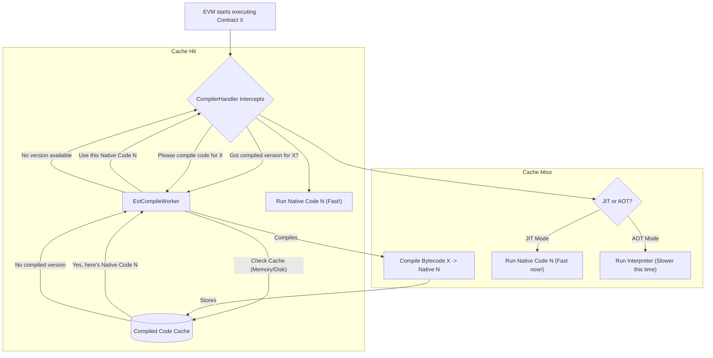
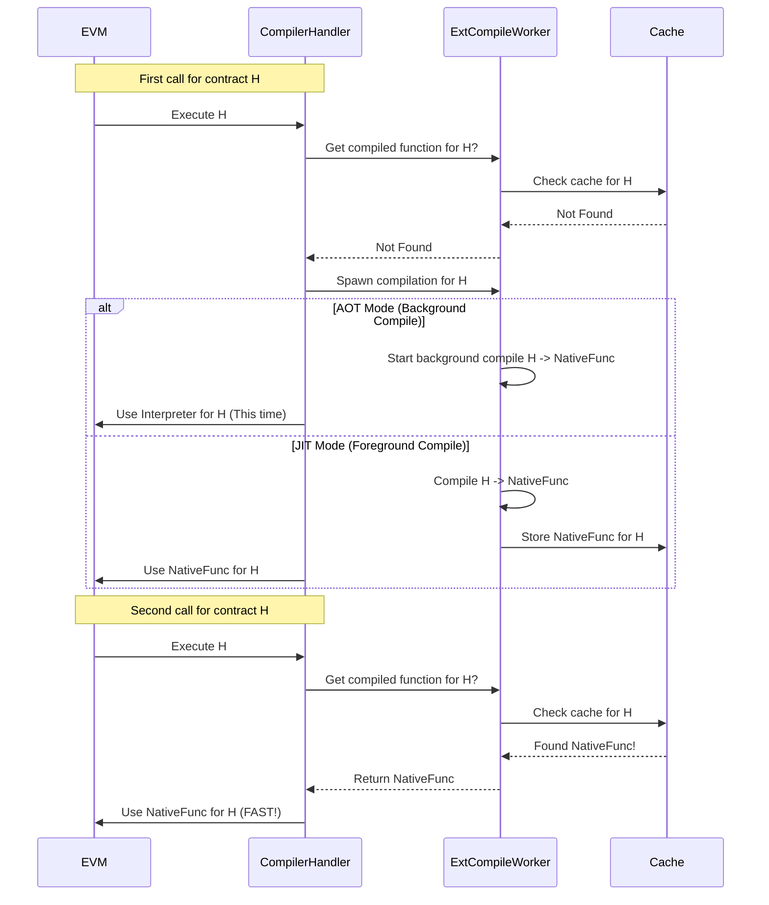

The EVM executes instructions written in a special language called "EVM bytecode". This is like a universal instruction set for Ethereum contracts. However, computers don't directly understand EVM bytecode; they understand their own "native machine code". Usually, the EVM acts as an _interpreter_, reading each bytecode instruction one by one and translating it on the spot. This works, but interpretation can be slower than running native code directly.

## What Problem Are We Solving?

**The Bottleneck:** Executing smart contracts involves interpreting EVM bytecode, which can be computationally intensive and slow down transaction processing. Each time a contract function is called, the interpreter might have to go through the same translation steps.

**The Goal:** We want to speed up contract execution by converting the general EVM bytecode into the specific, highly optimized native machine code that the computer's processor understands directly. Ideally, we do this translation once and reuse the result.

**The Analogy: The Translator**

Imagine you have a book written in a foreign language (EVM bytecode) that you need to understand.

- **Interpreter:** You have a friend who reads the book sentence by sentence and translates it for you live. This works, but it's slow, and they have to re-translate every time you re-read a page.
- **Compiler (AOT - Ahead-of-Time):** You hire a professional translator to translate the _entire book_ into your native language beforehand and give you the translated copy (native machine code). Now, you can read the translated book directly, which is much faster.
- **Compiler (JIT - Just-in-Time):** Your friend is clever. The first time you ask them to read a chapter, they quickly translate it and write down the translation. The next time you ask for that chapter, they just read you their written translation, which is faster than translating live again.

**The Solution:** `ExtCompileWorker` and `CompilerHandler` work together to act like this translator, converting EVM bytecode into native machine code to potentially speed up execution.

- **`ExtCompileWorker`:** This is the background worker, the actual translator. It takes EVM bytecode and uses powerful tools (like LLVM via the `revmc` library) to compile it into native code. It also manages a cache (like a library of translated books or chapters) so it doesn't have to re-translate the same code over and over. It can operate in two main modes:
  - **AOT (Ahead-of-Time):** Compiles code and saves the result (often to disk) before it's needed.
  - **JIT (Just-in-Time):** Compiles code the first time it's executed and keeps the result in memory for subsequent calls.
- **`CompilerHandler`:** This component integrates with the `revm` (the EVM implementation). When the EVM is about to execute a contract, the `CompilerHandler` intercepts this. It checks with the `ExtCompileWorker` if a compiled version of the contract already exists in the cache. If yes, it tells the EVM to run the super-fast native code. If not, it might ask the `ExtCompileWorker` to compile it (either now for JIT, or in the background for AOT) and might fall back to the slower interpreter for the current execution.



## How to Use Them (Integration View)

As a user of `metis-sdk`, you typically don't interact with `CompilerHandler` directly during transaction execution. It's an optional feature that gets enabled when setting up the execution environment.

For example, the core [Parallel Executor](pe) (`metis_pe::ParallelExecutor`) can be configured to use a compiler.

```rust
// -- File: crates/pe/src/executor.rs (Simplified ParallelExecutor setup) --
use std::sync::Arc;
#[cfg(feature = "compiler")]
use metis_vm::ExtCompileWorker; // The worker component

#[derive(Debug)]
#[cfg_attr(not(feature = "compiler"), derive(Default))]
pub struct ParallelExecutor {
    // ... other fields ...
    /// The compile worker shared with different vm instances.
    #[cfg(feature = "compiler")]
    pub worker: Arc<ExtCompileWorker>,
}

#[cfg(feature = "compiler")]
impl Default for ParallelExecutor {
    fn default() -> Self {
        Self {
            // ... other fields default ...
            // By default, the worker might be disabled
            worker: Arc::new(ExtCompileWorker::disable()),
        }
    }
}

impl ParallelExecutor {
    /// Create a parallel executor with the AOT compiler enabled.
    #[cfg(feature = "compiler")]
    pub fn compiler() -> Self {
        Self {
            // Initialize with an AOT worker instance
            worker: Arc::new(ExtCompileWorker::aot().expect("compile worker init failed")),
            ..Default::default()
        }
    }
}
```

**Explanation:**

- The `ParallelExecutor` struct has an optional field `worker` of type `Arc<ExtCompileWorker>`. An `Arc` allows multiple parts of the system (like different EVM instances running in parallel) to safely share the same compiler worker and its cache.
- The `compiler()` constructor creates a `ParallelExecutor` instance initialized with an active `ExtCompileWorker` (using AOT mode in this example).
- When this `ParallelExecutor` runs transactions (as seen in [Parallel Executor](pe)), the internal `Vm` helper ([VmDB](vmdb)) can pass this shared `worker` to the `revm` execution context, enabling the `CompilerHandler`.

The actual usage often happens deep inside the EVM execution loop, facilitated by the `CompilerHandler`. Let's look at a simplified example inspired by how one might use it directly with `revm` (which `metis-sdk` does internally).

```rust
// -- Based on: crates/vm/examples/aot_compiler.rs (Simplified) --
use metis_vm::{CompilerHandler, Error}; // Import the handler
use revm::{Context, database::{CacheState, State}, handler::Handler};
use metis_primitives::{SpecId, TxKind, U256, address, keccak256, Bytecode};
// ... other imports ...

fn main() -> Result<(), Error> {
    // 1. Prepare state and EVM context (like in previous chapters)
    let mut state: State<CacheState> = /* ... setup database state ... */ State::new(CacheState::new(true));
    let mut evm = Context::mainnet()
        // ... configure EVM environment (chain, block, tx) ...
        .with_db(&mut state)
        .build_mainnet();

    // 2. *** Create the CompilerHandler ***
    //    We choose AOT mode here. Use CompilerHandler::jit()? for JIT.
    let mut compile_handler = CompilerHandler::aot()?;

    // 3. *** Run the transaction using the Handler ***
    //    Instead of evm.transact(), we use handler.run(&mut evm).
    println!("Running first time (may compile)...");
    let result1 = compile_handler.run(&mut evm)?;
    println!("Result 1: GasUsed={}", result1.result.gas_used());

    // 4. *** Run again ***
    //    If compilation happened, this run should use the cached native code.
    println!("Running second time (should use cache)...");
    // Reset necessary parts of EVM state if needed before re-running
    let result2 = compile_handler.run(&mut evm)?;
    println!("Result 2: GasUsed={}", result2.result.gas_used()); // Gas might differ slightly

    Ok(())
}
```

**Explanation:**

- We set up the `revm` EVM context as usual.
- We create an instance of `CompilerHandler`, choosing either `aot()` or `jit()`. This handler holds a reference to an `ExtCompileWorker` internally.
- Instead of calling the standard `evm.transact()`, we use `compile_handler.run(&mut evm)`. This lets the handler intercept the execution.
- The first time `run` is called for a specific contract code, the handler might trigger compilation (if the feature is enabled and code isn't cached).
- Subsequent calls to `run` for the same contract code should hit the cache managed by the `ExtCompileWorker` and potentially execute faster using the compiled native code.

## Under the Hood: How Compilation Happens

Let's trace the simplified flow when the `CompilerHandler` encounters contract code for the first time:

1.  **EVM Call:** The `revm` EVM, configured with the `CompilerHandler`, is about to execute a contract identified by its `code_hash`.
2.  **Handler Intercepts:** The `CompilerHandler`'s `frame_call` method is invoked.
3.  **Cache Check:** The handler asks its internal `ExtCompileWorker`: "Do you have a compiled function for `code_hash` in your cache?" (`worker.get_function(&code_hash)`).
4.  **Worker Checks Cache:**
    - **JIT:** Checks an in-memory map (`HashMap`).
    - **AOT:** Checks an in-memory LRU cache first. If not found, it checks if a compiled shared object file (`.so`) exists on disk in the configured storage path (e.g., `~/.cache/metis/vm/aot/<code_hash>/a.so`). If it finds the file, it loads it into memory and into the cache.
5.  **Cache Miss:** The cache doesn't contain the compiled function.
6.  **Request Compilation:** The handler tells the `ExtCompileWorker`: "Please compile the bytecode for `code_hash` for the current `SpecId`." (`worker.spawn(...)`).
7.  **Worker Compiles:** The `ExtCompileWorker` uses its `CompilePool` to manage compilation tasks (potentially using background threads).
    - A `Compiler` instance uses `revmc` with an LLVM backend to translate the EVM bytecode into LLVM Intermediate Representation (IR) and then into native machine code.
    - **JIT:** The resulting native function is stored directly in the JIT cache (in-memory `HashMap`).
    - **AOT:** The compiled native code is written to an object file (`.o`) and then linked into a shared object file (`.so`) saved to disk under the `code_hash`.
8.  **Execution:**
    - **JIT:** Since compilation might happen quickly in the foreground, the handler _might_ immediately use the newly compiled function for the current execution.
    - **AOT:** Compilation might happen in the background. For this _first_ execution, the `CompilerHandler` tells the `revm` EVM to proceed using the standard bytecode _interpreter_.
9.  **Subsequent Calls:** The next time the EVM needs to execute the same `code_hash`, the `CompilerHandler` checks the cache again (Step 3). This time, it should be a **Cache Hit**. The worker returns the native function pointer, and the handler instructs the EVM to execute the highly optimized native code directly, skipping the interpreter.

**Simplified Sequence Diagram (Cache Miss followed by Cache Hit):**



## Diving Deeper into the Code (Simplified)

Let's look at the key structs and methods involved.

**1. `ExtCompileWorker` (`crates/vm/src/compiler.rs`)**

Manages the compilation pool and cache access logic.

```rust
// -- File: crates/vm/src/compiler.rs (Simplified ExtCompileWorker) --
use crate::pool::CompilePool; // Manages actual compilation tasks
use std::sync::Arc;
use std::path::PathBuf;
use metis_primitives::{B256, Bytes, SpecId};
use crate::error::Error;

// Represents result of cache lookup
#[derive(PartialEq, Debug)]
pub enum FetchedFnResult {
    Found(revmc::EvmCompilerFn), // Native function pointer
    NotFound,
}

// Manages compilation and caching
pub struct ExtCompileWorker {
    // The pool that handles background compilation tasks
    pool: Option<CompilePool>,
    // Name used for compiled modules (usually constant)
    module_name: String,
    // Path where AOT compiled files are stored
    store_path: PathBuf,
}

impl ExtCompileWorker {
    // Constructor for AOT mode
    pub fn aot() -> Result<Self, Error> { /* ... setup AOT pool ... */ Ok(Self{ pool: None, module_name: "".to_string(), store_path: PathBuf::new() }) }
    // Constructor for JIT mode
    pub fn jit() -> Result<Self, Error> { /* ... setup JIT pool ... */ Ok(Self{ pool: None, module_name: "".to_string(), store_path: PathBuf::new() }) }
    // Constructor to disable compiler
    pub fn disable() -> Self { /* ... set pool to None ... */ Self{ pool: None, module_name: "".to_string(), store_path: PathBuf::new() } }

    // Check cache (memory/disk) for compiled function
    pub fn get_function(&self, code_hash: &B256) -> Result<FetchedFnResult, Error> {
        let Some(pool) = &self.pool else { return Ok(FetchedFnResult::NotFound); };
        // 1. Try locking the cache (might be JIT HashMap or AOT LruCache)
        let mut cache_lock = pool.cache.write().map_err(|_| Error::Internal("Cache lock poisoned".into()))?;
        // 2. Check in-memory cache first
        if let Some(func) = cache_lock.get(code_hash) {
             return Ok(FetchedFnResult::Found(*func));
        }
        // 3. If AOT, check disk and load if found
        if cache_lock.is_aot() {
             let file_path = self.store_path.join(code_hash.to_string()).join("a.so");
             if file_path.exists() {
                  // Load the .so library and get the function symbol
                  // (Simplified - involves libloading)
                  let func: revmc::EvmCompilerFn = /* ... load from file ... */ unsafe { std::mem::zeroed() };
                  // Add to AOT memory cache
                  // cache_lock.put(*code_hash, (func, loaded_library));
                  return Ok(FetchedFnResult::Found(func));
             }
        }
        // 4. Not found anywhere
        Ok(FetchedFnResult::NotFound)
    }

    // Ask the pool to compile the code (likely async)
    pub fn spawn(&self, spec_id: SpecId, code_hash: B256, bytecode: Bytes) -> Result<(), Error> {
        if let Some(pool) = &self.pool {
             // The pool manages threads and the actual compiler call
             pool.spawn(spec_id, code_hash, bytecode)?;
        }
        Ok(())
    }
}
```

**Explanation:**

- Holds an optional `CompilePool` which does the heavy lifting of compilation using background threads.
- `get_function` implements the cache lookup logic: check memory cache -> check disk (if AOT) -> return found function or `NotFound`.
- `spawn` delegates the compilation request to the `CompilePool`.

**2. `CompilerHandler` (`crates/vm/src/compiler.rs`)**

Integrates with `revm`'s execution flow using the `Handler` trait.

```rust
// -- File: crates/vm/src/compiler.rs (Simplified CompilerHandler) --
use revm::{
    Database, EvmTr, Handler, FrameResult, FrameInitOrResult,
    handler::{EthFrame, instructions::InstructionProvider},
    interpreter::{InterpreterResult, interpreter::EthInterpreter},
    context::{ContextTr, JournalTr, JournalOutput, result::{EVMError, InvalidTransaction, HaltReason}},
    precompile::PrecompileProvider,
};
use std::sync::Arc;

// The handler that plugs into revm
pub struct CompilerHandler<EVM> {
    // Shared reference to the worker that does compilation/caching
    pub worker: Arc<ExtCompileWorker>,
    _phantom: core::marker::PhantomData<EVM>, // Generic marker
}

impl<EVM> Handler for CompilerHandler<EVM>
where
    EVM: EvmTr /* ... generic bounds for EVM context ... */
{
    type Evm = EVM;
    // ... other Handler associated types (Error, Frame, HaltReason) ...
    type Error = EVMError<<<EVM::Context as ContextTr>::Db as Database>::Error, InvalidTransaction>;
    type Frame = EthFrame<
        EVM,
        EVMError<<<EVM::Context as ContextTr>::Db as Database>::Error, InvalidTransaction>,
        <EVM::Instructions as InstructionProvider>::InterpreterTypes,
    >;
    type HaltReason = HaltReason;


    // This method is called by revm before executing contract code
    fn frame_call(
        &mut self,
        frame: &mut Self::Frame, // Represents the current execution frame
        evm: &mut Self::Evm,     // The EVM state and context
    ) -> Result<FrameInitOrResult<Self::Frame>, Self::Error> {

        let interpreter = &mut frame.interpreter; // Access the interpreter state
        let code_hash = interpreter.bytecode.hash(); // Get hash of the code to run

        let next_action = match code_hash {
            Some(hash) => {
                // Ask the worker to check the cache
                match self.worker.get_function(&hash) {
                    Ok(FetchedFnResult::Found(compiled_func)) => {
                        // *** CACHE HIT ***
                        // TODO: Actually call the compiled function.
                        // Currently revmc doesn't directly support replacing the interpreter loop yet.
                        // See: https://github.com/paradigmxyz/revmc/issues/75
                        // For now, we still fall back to the interpreter even on cache hit.
                        // compiled_func.call_with_interpreter(...)
                        evm.run_interpreter(interpreter) // Placeholder: Use interpreter
                    }
                    Ok(FetchedFnResult::NotFound) => {
                        // *** CACHE MISS ***
                        // Ask the worker to compile this code (likely async)
                        let spec_id = evm.ctx().cfg().spec().into();
                        let bytecode = interpreter.bytecode.bytes();
                        let _ = self.worker.spawn(spec_id, hash, bytecode);

                        // Use the standard interpreter for *this* execution
                        evm.run_interpreter(interpreter)
                    }
                    Err(_) => {
                        // Error during cache lookup, fallback to interpreter
                        evm.run_interpreter(interpreter)
                    }
                }
            }
            None => {
                // No code hash (e.g., empty code), use interpreter
                evm.run_interpreter(interpreter)
            }
        };

        // Process the result of the interpreter/compiled function run
        frame.process_next_action(evm, next_action)
    }

    // ... other Handler methods (like reward_beneficiary) can be overridden ...
}

// Helper constructors
impl<EVM> CompilerHandler<EVM> {
    pub fn new(worker: Arc<ExtCompileWorker>) -> Self { /* ... */ Self { worker, _phantom: Default::default() } }
    pub fn aot() -> Result<Self, Error> { Ok(Self::new(Arc::new(ExtCompileWorker::aot()?))) }
    pub fn jit() -> Result<Self, Error> { Ok(Self::new(Arc::new(ExtCompileWorker::jit()?))) }
}
```

**Explanation:**

- Implements the `revm::Handler` trait.
- The key method is `frame_call`, which gets invoked before `revm` runs contract code.
- Inside `frame_call`, it gets the `code_hash` of the contract.
- It calls `self.worker.get_function()` to check the cache.
- If found (`FetchedFnResult::Found`), it _should_ ideally execute the returned native function pointer. (Note: Current integration might still use the interpreter as a placeholder).
- If not found (`FetchedFnResult::NotFound`), it calls `self.worker.spawn()` to request compilation and then proceeds with the standard interpreter for this run.

## Conclusion

The `ExtCompileWorker` and `CompilerHandler` are optional but powerful components in `metis-sdk` designed to accelerate EVM execution. By translating frequently used EVM bytecode into native machine code (using JIT or AOT strategies) and caching the results, they reduce the overhead of interpretation.

- **`ExtCompileWorker`** is the engine performing the compilation and managing the cache.
- **`CompilerHandler`** integrates this process into the `revm` execution flow, checking the cache and coordinating compilation requests.

While the exact performance gains depend on the workload and contracts, this compilation step is a common technique for optimizing virtual machine performance.

We've now explored scheduling, memory management, database interaction, and even execution optimization through compilation. What other kinds of advanced features can extend the execution capabilities? Let's look at a specific example related to AI integration next.
