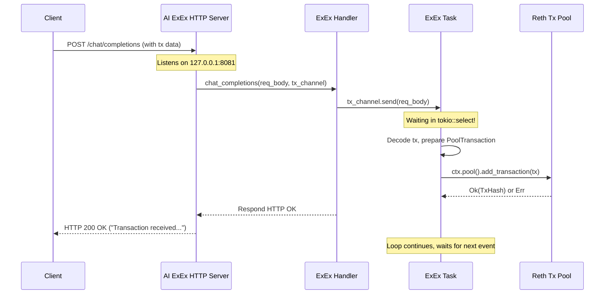

In [CompilerHandler](ch), we explored how we can optionally speed up smart contract execution by compiling EVM bytecode into faster native code. We've covered parallel execution, memory management, database interactions, and even compilation.

Now, let's look at something different: how can we add entirely new, custom functionality that runs _alongside_ our Reth node? What if we want our node setup to include a service that isn't part of the standard blockchain protocol, like an AI model?

## What Problem Are We Solving?

Imagine you want to build a service where users can interact with an AI chatbot, and based on the conversation, a blockchain transaction needs to be created and submitted. For example, maybe the AI helps configure a complex DeFi operation, and the final step is to submit the resulting transaction to the network.

**The Challenge:** A standard blockchain node (like Reth) doesn't have a built-in AI chatbot or a direct way to listen for specific external API calls related to AI. How can we integrate such custom functionality _with_ the node?

**The Goal:** We need a way to run our custom service (like an AI inference server) alongside the Reth node, allow external systems to interact with it (e.g., via HTTP), and let this service interact with the node's components (like submitting a transaction to the pool).

**The Solution:** Reth provides a powerful mechanism called **ExEx (Execution Extension)**.

## Meet ExEx: Your Node's Custom Sidekick

Think of your Reth node as a sophisticated workshop focused on processing blockchain tasks. An ExEx is like adding a specialized, custom-built tool or even a whole separate workstation _inside_ your main workshop.

**ExEx = Execution Extension**

It's a module that you can design to run _within_ the Reth node's process but operate somewhat independently. Key features:

1.  **Runs Alongside:** It starts up with the node and runs concurrently.
2.  **Custom Logic:** You define what the ExEx does. It could be anything – an AI server, a custom monitoring tool, a bridge to another system, etc.
3.  **Node Interaction:** It gets a special `ExExContext` that allows it to interact with parts of the Reth node, such as:
    - Accessing the transaction pool (to submit transactions).
    - Listening to node events (like new blocks being processed or finalized).
    - (Potentially) Reading blockchain state.
4.  **External Communication:** Your ExEx can open its own communication channels, like listening on an HTTP port for external requests.

**Analogy: The Workshop Extension**

Imagine your Reth workshop builds cars (processes blocks). You want to add a custom paint booth (our AI ExEx).

- The paint booth is installed _within_ the workshop complex (`install_exex`).
- It has its own controls and maybe an external order phone line (HTTP endpoint).
- It receives painting requests (AI inference requests).
- It can interact with the main workshop, like requesting a car chassis (accessing node state) or notifying the foreman when a paint job is done (submitting a transaction or emitting an event).

In our specific example, we'll build an AI ExEx that:

- Runs an HTTP server listening for `/chat/completions` requests.
- Receives raw transaction data within these requests.
- Submits these transactions to the Reth node's transaction pool.

## How to Use the AI ExEx

Let's see how we integrate and use this AI extension.

**1. Installing the ExEx (`main.rs`)**

First, we need to tell our Reth node to load and run our custom ExEx during startup. This is done in the `main.rs` file where we configure the node.

```rust
// -- File: crates/chain/bin/main.rs (Simplified) --
use metis_chain::provider::ParallelExecutorBuilder;
use reth::cli::Cli;
use reth_node_ethereum::EthereumNode;
use reth_node_ethereum::node::EthereumAddOns;
// ... other imports ...

fn main() {
    // ... setup ...

    if let Err(err) = Cli::parse_args().run(async move |builder, _| {
        let mut handle = builder
            .with_types::<EthereumNode>()
            .with_components(
                EthereumNode::components()
                    .executor(ParallelExecutorBuilder::default()) // Use parallel executor
            )
            .with_add_ons(EthereumAddOns::default());

        // *** THIS IS THE KEY PART ***
        // Check if the 'inference' feature is enabled
        #[cfg(feature = "inference")]
        {
            // Install our AI ExEx, identified by a unique name
            handle = handle.install_exex(metis_chain::exex::AI_EXEX_ID, move |ctx| {
                // This closure runs when the ExEx is initialized.
                // It sets up and starts the ExEx logic.
                use futures::FutureExt;
                tokio::task::spawn_blocking(move || {
                    // Run the ExEx setup in a blocking-safe thread
                    tokio::runtime::Handle::current().block_on(async move {
                        // Create a channel for communication (HTTP Server -> ExEx Task)
                        let (tx, rx) = tokio::sync::mpsc::channel(512);

                        // Start the HTTP Server in the background
                        tokio::spawn(async move {
                            actix_web::HttpServer::new(move || {
                                actix_web::App::new()
                                    // Share the sender part of the channel with handlers
                                    .app_data(actix_web::web::Data::new(tx.clone()))
                                    .service(metis_chain::exex::chat_completions) // Register HTTP endpoint
                            })
                            .bind(metis_chain::exex::DEFAULT_AI_ADDR)? // Bind to address
                            .run() // Run the server
                            .await
                        }); // Error handling omitted for brevity

                        // Create and start the main ExEx task, passing the context and receiver
                        Ok(metis_chain::exex::ExEx::new(ctx, rx).start())
                    })
                })
                // Map results back to the expected types
                .map(|result| result.map_err(Into::into).and_then(|result| result))
            });
        }

        handle.launch().await?.wait_for_node_exit().await // Launch the node (with ExEx)
    }) {
        eprintln!("Error: {err:?}");
        std::process::exit(1);
    }
}
```

**Explanation:**

- We use the `install_exex` method on the node builder `handle`.
- We provide a unique ID (`AI_EXEX_ID`) for our extension.
- We provide a closure that takes the `ExExContext` (`ctx`) as input. This context is our bridge to the Reth node.
- Inside the closure:
  - We create a communication channel (`mpsc::channel`) - this is how our HTTP server will send data to the main ExEx logic. `tx` is the sender, `rx` is the receiver.
  - We spawn an asynchronous task to run an Actix web server. This server listens for HTTP requests on a specific address (`DEFAULT_AI_ADDR`).
  - The web server is configured to use our `chat_completions` handler (we'll see this next) and is given the `tx` (sender) part of the channel so the handler can send data.
  - We create an instance of our `ExEx` struct (defined in `exex.rs`), passing it the `ctx` and the `rx` (receiver) end of the channel.
  - We call `.start()` on the `ExEx` instance, which contains the main logic loop for our extension.
- The `tokio::task::spawn_blocking` and `.map(...)` parts handle running the potentially blocking setup code correctly within the async environment.

**2. The HTTP Request Handler (`exex.rs`)**

This function runs inside the Actix web server. It defines what happens when a `POST` request hits the `/chat/completions` endpoint.

```rust
// -- File: crates/chain/src/exex.rs (Simplified Handler) --
use actix_web::{HttpResponse, Responder, post, web};
use serde::{Deserialize, Serialize};
use tokio::sync::mpsc;

// Structure expected in the JSON body of the POST request
#[derive(Deserialize, Serialize, Clone)]
pub struct InferenceRequest {
    transaction: String, // Raw transaction hex string (e.g., "0x...")
    // Other fields might exist (id, tokens_of_inference)
    // ...
}

// The actual HTTP endpoint handler function
#[post("/chat/completions")]
async fn chat_completions(
    // Extracts the JSON body into our InferenceRequest struct
    req_body: web::Json<InferenceRequest>,
    // Gets the shared channel sender (setup in main.rs)
    tx: web::Data<mpsc::Sender<InferenceRequest>>,
) -> impl Responder {
    // Send the received request data over the channel to the ExEx task
    if let Err(e) = tx.send(req_body.into_inner()).await {
        eprintln!("Failed to send request to ExEx task: {}", e);
        return HttpResponse::InternalServerError()
            .body(format!("Failed to queue transaction: {}", e));
    }

    // Respond to the client that the request was accepted
    HttpResponse::Ok().body("Transaction received and queued by ExEx.")
}
```

**Explanation:**

- The `#[post("/chat/completions")]` macro routes POST requests to this function.
- Actix automatically deserializes the JSON request body into our `InferenceRequest` struct (`req_body`).
- It gets access to the channel sender (`tx`) that we provided when setting up the server.
- `tx.send(req_body.into_inner()).await`: This is the crucial step where the handler forwards the received data to the main `ExEx` task via the channel.
- It returns an `HttpResponse::Ok` to the original caller, indicating the request was received.

**3. The ExEx Core Logic (`ExEx` struct and `start` method in `exex.rs`)**

This is the main part of our custom extension that runs continuously alongside Reth.

```rust
// -- File: crates/chain/src/exex.rs (Simplified ExEx struct and start) --
use reth::transaction_pool::{TransactionPool, TransactionOrigin, PoolTransaction};
use reth_ethereum::exex::{ExExContext, ExExEvent};
use reth_ethereum::node::api::FullNodeComponents;
use reth_primitives::{hex, Recovered};
use reth_rpc_types::TransactionRequest; // Assuming request contains this
use reth_tracing::tracing::info;
use tokio::sync::mpsc;
use futures::TryStreamExt; // For try_next() on notifications

// The ExEx struct holds the context and communication channel receiver
pub struct ExEx<Node: FullNodeComponents> {
    ctx: ExExContext<Node>,             // Context to interact with Reth
    rx: mpsc::Receiver<InferenceRequest>, // Receives requests from HTTP handler
}

impl<Node: FullNodeComponents> ExEx<Node> {
    // Constructor called from main.rs
    pub fn new(ctx: ExExContext<Node>, rx: mpsc::Receiver<InferenceRequest>) -> Self {
        Self { ctx, rx }
    }

    // The main loop of the ExEx
    pub async fn start(mut self) -> eyre::Result<()> {
        info!(target: AI_EXEX_ID, "AI ExEx started");
        loop {
            // Use tokio::select! to concurrently handle multiple event sources
            tokio::select! {
                // 1. Handle incoming requests from the HTTP server via the channel
                Some(request) = self.rx.recv() => {
                    info!(target: AI_EXEX_ID, "Received inference request");
                    // Decode the hex transaction string
                    let transaction_bytes = match hex::decode(request.transaction.trim_start_matches("0x")) {
                         Ok(bytes) => bytes,
                         Err(e) => {
                             info!(target: AI_EXEX_ID, "Failed to decode tx hex: {}", e);
                             continue; // Skip invalid request
                         }
                    };

                    // Recover the transaction (verify signature, get sender)
                    // recover_raw_transaction needs specific types, simplified here
                    // let recovered_tx: RecoveredTransaction = recover_raw_transaction(&tx_bytes)?;

                    // Convert to the pool's expected transaction type
                    // let pool_transaction = Node::Pool::Transaction::from_recovered(recovered_tx);

                    // *** Interact with Reth: Submit to Transaction Pool ***
                    // let result = self.ctx.pool().add_transaction(
                    //     TransactionOrigin::Local, // Mark as locally submitted
                    //     pool_transaction
                    // ).await;

                    // if let Err(e) = result {
                    //      info!(target: AI_EXEX_ID, "Failed to add tx to pool: {}", e);
                    // } else if let Ok(hash) = result {
                    //      info!(target: AI_EXEX_ID, ?hash, "Submitted transaction to pool");
                    // }
                     info!(target: AI_EXEX_ID, "Transaction submitted to pool (simulated)"); // Simplified
                }

                // 2. Handle notifications from the Reth node (e.g., new blocks)
                //    Use try_next() for non-blocking check if stream ends
                Ok(Some(notification)) = self.ctx.notifications.try_next() => {
                    if let Some(committed_chain) = notification.committed_chain() {
                        // We received a notification about a finalized chain segment
                        let tip = committed_chain.tip();
                        info!(target: AI_EXEX_ID, block_number = tip.number, block_hash = ?tip.hash, "Chain commit notification");

                        // Tell Reth we've processed up to this point
                        self.ctx.events.send(ExExEvent::FinishedHeight(tip.num_hash()))?;
                    }
                     // Handle other notification types if needed...
                }

                // Use '.biased;' with select! if one branch should always be checked first
                // Or handle stream closing / errors if needed
                else => {
                     // Channel closed or notification stream ended, break the loop
                     info!(target: AI_EXEX_ID, "ExEx channel or notification stream closed. Shutting down.");
                     break;
                }
            }
        }
        Ok(())
    }
}
```

**Explanation:**

- The `ExEx` struct holds the `ctx` (for node interaction) and `rx` (to receive messages from the HTTP handler).
- The `start` method contains the main `loop`.
- `tokio::select!`: This is important! It allows the ExEx to wait for _multiple_ things simultaneously:
  - Waiting for a message on the `rx` channel (from the HTTP handler).
  - Waiting for a notification from the Reth node via `self.ctx.notifications`.
- **Handling HTTP Requests:** When a message `request` arrives on `rx`:
  - It decodes the transaction string from hex to bytes.
  - (Simplified) It would normally recover the transaction to ensure validity and get the sender's address.
  - (Simplified) It would convert the transaction into the format expected by the transaction pool (`PoolTransaction`).
  - `self.ctx.pool().add_transaction(...)`: This is where the ExEx interacts with Reth! It submits the transaction to the node's transaction pool, just as if it came from an RPC call. `TransactionOrigin::Local` indicates it didn't come from the P2P network.
- **Handling Node Notifications:** When a `notification` arrives from Reth:
  - We check if it contains information about a newly committed/finalized part of the chain (`committed_chain()`).
  - If so, we can react to it (e.g., log the new block height).
  - `self.ctx.events.send(ExExEvent::FinishedHeight(...))`: This is crucial for coordination. The ExEx tells Reth the highest block number it has processed, allowing Reth to manage its state accordingly (e.g., prune older states that the ExEx no longer needs).
- The loop continues indefinitely until one of the channels closes.

## Under the Hood: How It All Connects

Let's visualize the flow when an external client sends a request to our AI ExEx:

**1. Step-by-Step Flow:**

1.  An external application sends an HTTP POST request to `http://127.0.0.1:8081/chat/completions` with a JSON body containing a raw transaction hex string.
2.  The Actix web server (running as a background task within the Reth process) receives this request.
3.  The `chat_completions` handler function is invoked.
4.  The handler takes the `InferenceRequest` data.
5.  The handler sends this data over the `mpsc` channel (`tx.send(...)`).
6.  The main `ExEx::start` loop, which was waiting in `tokio::select!` on `rx.recv()`, wakes up because data is available.
7.  The `ExEx` task receives the `InferenceRequest`.
8.  It decodes the transaction string.
9.  It calls `ctx.pool().add_transaction()` to submit the transaction to the Reth node's transaction pool.
10. The Reth transaction pool processes the transaction as usual (validation, propagation, etc.).
11. Meanwhile, the `chat_completions` handler already returned an HTTP "OK" response to the original client.
12. The `ExEx` task continues its loop, waiting for the next HTTP request or node notification.

**2. Sequence Diagram:**



## Conclusion

ExEx (Execution Extension) is a powerful feature in Reth that allows developers to extend the node's capabilities with custom, co-processing modules. We saw how this can be used to integrate an AI service that listens for external HTTP requests and interacts with the node by submitting transactions to the pool.

The key components are:

- The `install_exex` setup in `main.rs`.
- An optional external communication layer (like an HTTP server).
- A communication channel between the communication layer and the main ExEx task.
- The `ExEx` struct holding the `ExExContext` (for node interaction) and channel receiver.
- The `ExEx::start` method containing the main loop, often using `tokio::select!` to handle both external requests and internal node notifications.

This allows for sophisticated integrations, turning a standard blockchain node into a platform capable of much more than just processing blocks and transactions according to predefined rules.
