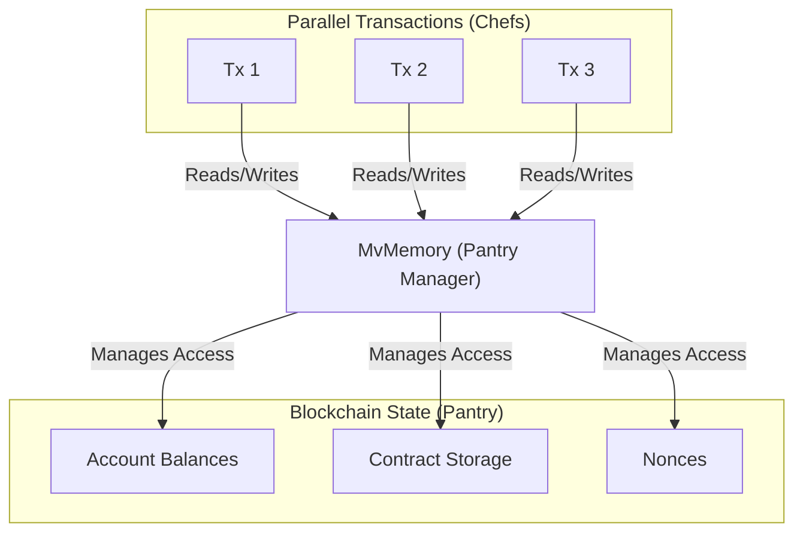
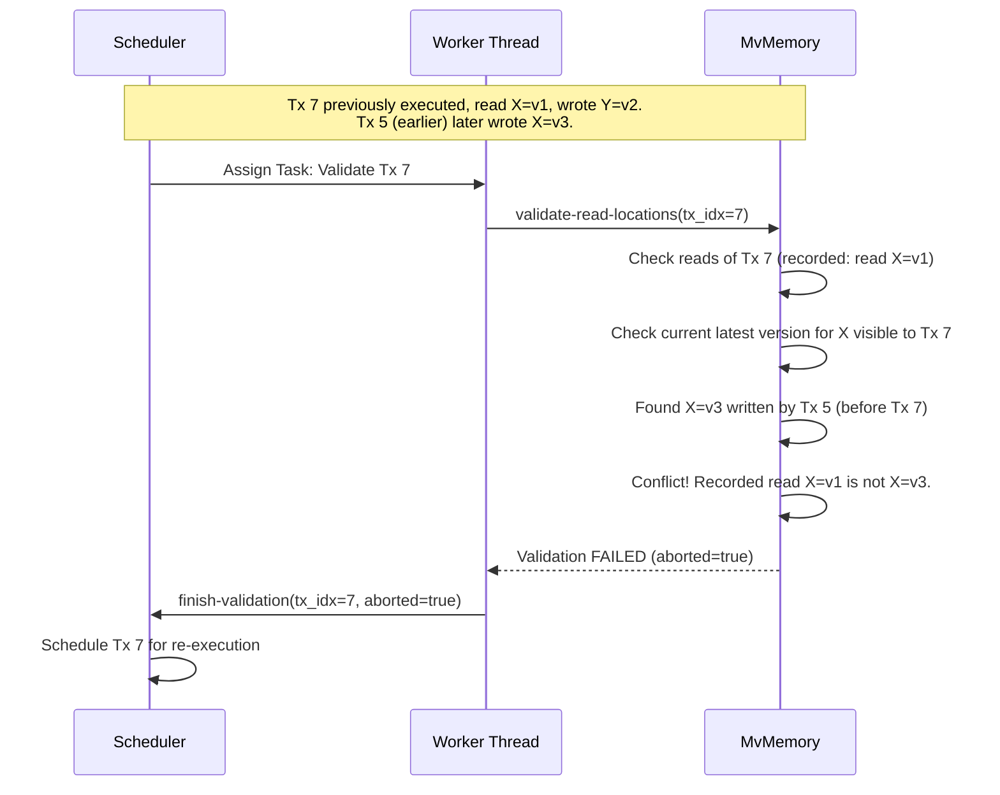

In [Scheduler](scheduler), we saw how the Scheduler acts like an air traffic controller, coordinating multiple worker threads executing transactions in parallel. We learned that the Scheduler needs to know if conflicts happen – situations where one transaction's actions invalidate another's. But how does the Scheduler *get* that information?

This is where our next key component comes in: **MvMemory (Multi-Version Memory)**.

## What Problem Does MvMemory Solve?

Imagine a busy shared kitchen where several chefs (parallel worker threads) are trying to cook different dishes (execute transactions) simultaneously. They all need to use shared ingredients from the pantry (blockchain state like account balances or contract data).

*   **Challenge 1: Reading:** Chef A needs to know how much flour is left. Chef B also needs to know. They need to get the *current* correct amount.
*   **Challenge 2: Writing:** Chef A uses some flour. Chef C also uses some flour. How do we track these changes without them overwriting each other's work instantly?
*   **Challenge 3: Conflicts:** Chef B reads the flour amount (say, 1kg). While Chef B is preparing their dish, Chef A *uses* 0.5kg of flour and puts the bag back. Now Chef B's initial reading of 1kg is outdated! If Chef B tries to use 1kg based on their old reading, they'll run into trouble.

**The Goal:** We need a system for this shared pantry (blockchain state) that allows chefs (transactions) to:
1.  Read the latest *stable* version of an ingredient's state.
2.  Record their intended changes *without* immediately affecting others.
3.  Track who changed what and when, so we can detect if someone based their work on outdated information (like Chef B reading the flour amount before Chef A used some).

**The Solution:** `MvMemory` is this specialized pantry management system.



`MvMemory` acts as an intermediary between the parallel transactions and the actual blockchain state. It keeps track of multiple "versions" of data items (like the amount of flour) as different transactions propose changes.

Think of it like a collaborative document (like Google Docs):
*   Multiple people can view the document (read state).
*   Multiple people can type suggestions simultaneously (propose writes).
*   The system tracks each person's changes (versions).
*   If two people edit the *exact same sentence* at the same time, the system might flag it as a conflict that needs resolving.

## How Does MvMemory Work?

`MvMemory` manages shared data by keeping multiple versions:

1.  **Reading Data:** When a transaction (Chef A) needs to read a piece of data (flour amount), `MvMemory` looks up the location (pantry shelf for flour). It finds the latest version written by a transaction that *comes before* Chef A in the original block order and has already been *successfully executed* (or the initial state if no one before A touched it). Chef A records *which version* they read.
2.  **Writing Data:** When Chef A finishes and wants to update the flour amount, they don't directly change the main value. Instead, they tell `MvMemory`: "I, Chef A, propose a new version for flour amount: 0.5kg." `MvMemory` stores this as a *potential* update associated specifically with Chef A's transaction index.
3.  **Tracking Versions:** `MvMemory` maintains a history for each data location. For "flour amount", it might look like:
    *   Initial State: 1kg
    *   Tx 5 proposes: 0.8kg (after using 0.2kg)
    *   Tx 12 proposes: 0.7kg (after using 0.1kg based on Tx 5's version)
    *   Tx 7 proposes: 0.5kg (after using 0.5kg based on the initial state)
4.  **Detecting Conflicts (Validation):** This is crucial. Let's say Tx 7 read the "Initial State: 1kg" version of flour. Later, the [Scheduler](scheduler) asks `MvMemory` to validate Tx 7. `MvMemory` checks: "Did any transaction *before* Tx 7 (like Tx 5) write a new version of flour *after* Tx 7 read the initial state?" In our example, yes! Tx 5 wrote "0.8kg". This means Tx 7's read ("Initial State: 1kg") was stale by the time Tx 5 finished. `MvMemory` reports this conflict back to the [Scheduler](scheduler), which will likely tell Tx 7 to re-execute using the correct data.

## Interaction with Scheduler and Workers

`MvMemory` doesn't work in isolation. It collaborates closely with worker threads and the [Scheduler](scheduler):

1.  **Worker Executes:** A worker thread executes a transaction (e.g., Tx 7). During execution, it interacts with `MvMemory` for reads (using a special database wrapper we'll see in [VmDB](vmdb)). It keeps track of what locations it read and what versions it got (`Read-Set`). It also tracks the changes it wants to make (`Write-Set`).
2.  **Worker Reports:** When the worker finishes executing Tx 7, it reports its `Read-Set` and `Write-Set` to `MvMemory` via the `record` function. `MvMemory` updates its internal version history. `MvMemory` also tells the worker which *later* transactions might now be affected because they might have read data that Tx 7 just changed.
3.  **Scheduler Validates:** The [Scheduler](scheduler) might later decide Tx 7 needs validation (if it read data that could have been changed by earlier transactions). It asks a worker to perform validation for Tx 7.
4.  **Worker Validates via MvMemory:** The worker calls `MvMemory`'s `validate-read-locations` function for Tx 7.
5.  **MvMemory Checks:** `MvMemory` compares Tx 7's original `Read-Set` (the versions it read initially) against the *current* state of its version history. It checks if any *earlier* transaction has committed a newer version for any location Tx 7 read.
6.  **MvMemory Responds:** `MvMemory` tells the worker whether the validation passed (reads are still valid) or failed (conflict detected).
7.  **Scheduler Acts:** The worker reports the validation result to the [Scheduler](scheduler), which then decides whether Tx 7 is truly finished or needs re-execution.

**Simplified Validation Flow:**



## Under the Hood: A Peek at the Code

The core logic for `MvMemory` resides in `crates/pe/src/mv-memory.rs`.

**1. The `MvMemory` Struct:**

This struct holds the multi-version data.

```rust
// -- File: crates/pe/src/mv-memory.rs (Simplified) --

use dashmap::DashMap; // Thread-safe hash map
use std::collections::{BTreeMap, BTreeSet};
use std::sync::Mutex;
use metis_primitives::{Address, B256, BuildIdentityHasher, BuildSuffixHasher};
use crate::{MemoryEntry, MemoryLocationHash, Read-Set, TxIdx, TxVersion, Write-Set};
use revm::bytecode::Bytecode;

#[derive(Debug)]
pub struct MvMemory {
    // *** The core multi-version data ***
    // Key: Hash of the memory location (e.g., account address, storage slot)
    // Value: A sorted map where:
    //   Key: Transaction Index (TxIdx) that wrote
    //   Value: The MemoryEntry (version + value) written by that Tx
    pub(crate) data: DashMap<MemoryLocationHash, BTreeMap<TxIdx, MemoryEntry>, BuildIdentityHasher>,

    // Tracks which transactions read which locations. Used for optimization.
    // Key: Hash of the memory location
    // Value: Set of TxIdx that read this location
    pub(crate) location-reads: DashMap<MemoryLocationHash, BTreeSet<TxIdx>, BuildIdentityHasher>,

    // Stores the latest Read-Set and Write-Set locations for each transaction.
    // Used for efficient validation and cleanup.
    last-locations: Vec<Mutex<LastLocations>>, // Simplified struct

    // Tracks addresses involved in lazy updates (e.g., balances)
    lazy-addresses: DashSet<Address, BuildSuffixHasher>,

    // Stores newly deployed contract bytecodes during the block execution
    pub(crate) new-bytecodes: DashMap<B256, Bytecode, BuildSuffixHasher>,
}

// Helper struct (simplified)
#[derive(Default, Debug)]
struct LastLocations {
    read: Read-Set,
    write: Vec<MemoryLocationHash>,
}
```

**Explanation:**

*   `data`: This is the heart of `MvMemory`. It's a thread-safe map (`DashMap`). Each key represents a unique piece of blockchain state (an account's balance, a specific storage slot). The value associated with each key is another map (`BTreeMap`) sorted by the transaction index (`TxIdx`). This inner map stores the different versions (`MemoryEntry`) written by different transactions. This structure allows quickly finding the latest version written by a transaction *before* a given `TxIdx`.
*   `location-reads`: Helps efficiently find which transactions might need re-validation when a location is updated.
*   `last-locations`: Caches the read/write sets per transaction for validation/cleanup.
*   `lazy-addresses`: Tracks accounts whose balances might be updated "lazily" (not strictly versioned on every small change) for performance.
*   `new-bytecodes`: Stores bytecode for contracts deployed within the current block.

**2. Memory Entries and Values (`MemoryEntry`, `MemoryValue`):**

These define what gets stored in the version history.

```rust
// -- File: crates/pe/src/types.rs (Simplified) --

use alloy_primitives::{Address, B256, U256};
use revm::state::AccountInfo;

// Represents a specific version written by a transaction
#[derive(Debug)]
pub enum MemoryEntry {
    // Contains the incarnation number and the actual data value
    Data(TxIncarnation, MemoryValue),
    // A placeholder indicating a previous write was aborted
    // and the next attempt is *expected* to write here again.
    // Reading an 'Estimate' causes the reader to abort early.
    Estimate,
}

// The actual data value stored in a MemoryEntry
#[derive(Debug, Clone, PartialEq, Eq)]
pub enum MemoryValue {
    // Basic account info (balance, nonce, code hash)
    Basic(AccountInfo),
    // Contract code hash
    CodeHash(B256),
    // Value of a storage slot
    Storage(U256),
    // Special value for lazy balance updates (recipient gets value)
    LazyRecipient(U256),
    // Special value for lazy balance updates (sender pays value)
    LazySender(U256),
    // Marker that an account was self-destructed
    SelfDestructed,
}

// Type alias for the incarnation number (re-execution count)
pub type TxIncarnation = usize;
```

**Explanation:**

*   `MemoryEntry`: Stores either the actual `Data` (with its `TxIncarnation` number and `MemoryValue`) or an `Estimate` marker used during conflict resolution.
*   `MemoryValue`: Represents the different kinds of data that can be stored in the blockchain state, including special types like `LazyRecipient`/`LazySender` for performance optimizations on frequent balance changes.

**3. Recording Writes (`record` method):**

This method is called by a worker after executing a transaction to save its changes and reads into `MvMemory`.

```rust
// -- File: crates/pe/src/mv-memory.rs (Simplified record method) --

impl MvMemory {
    // Called after TxVersion finishes execution
    pub(crate) fn record(
        &self,
        tx_version: &TxVersion, // Tx index and incarnation that just ran
        read_set: Read-Set,     // What this tx version read
        write_set: Write-Set,   // What this tx version wants to write
    ) -> Vec<TxIdx> { // Returns list of later TxIdx potentially affected

        // 1. Update location-reads based on the new read_set
        // (Code omitted for simplicity)

        // 2. Update last-locations cache
        let mut last_locations = index_mutex!(self.last-locations, tx_version.tx_idx);
        last_locations.read = read_set;
        // (Cleanup logic for old writes omitted)
        last_locations.write = write_set.keys().cloned().collect(); // Store new write locations

        // 3. Insert new writes into the main 'data' structure
        let mut changed_locations = Vec::new();
        for (location_hash, new_value) in write_set {
            // Get or create the version history for this location
            let mut entry = self.data.entry(location_hash).or_default();
            // Insert the new version (TxIdx -> MemoryEntry)
            let old_entry = entry.insert(
                tx_version.tx_idx,
                MemoryEntry::Data(tx_version.tx_incarnation, new_value.clone()),
            );

            // Check if the value actually changed compared to the previous write
            // by the *same* transaction index (if any).
            if old_entry.is_none() || /* value comparison logic */ true {
                 changed_locations.push(location_hash);
            }
        }

        // 4. Determine which *later* transactions might be affected
        //    by reading locations that were just changed.
        let affected_txs: HashSet<TxIdx> = changed_locations
            .iter()
            .flat_map(|loc_hash| {
                // Find transactions AFTER tx_version.tx_idx that READ this location
                // (Uses self.location-reads - logic omitted)
                find_readers_after(self, *loc_hash, tx_version.tx_idx)
            })
            .collect();

        affected_txs.into_iter().collect()
    }
}

// Dummy helper function signature
fn find_readers_after(mv_memory: &MvMemory, loc_hash: MemoryLocationHash, writer_tx_idx: TxIdx) -> Vec<TxIdx> {
    // ... implementation uses mv_memory.location-reads ...
    vec![] // Placeholder
}
```

**Explanation:**

*   It updates internal caches like `location-reads` and `last-locations`.
*   The core part iterates through the `write_set` provided by the worker.
*   For each location and new value, it accesses the `BTreeMap` for that location within the main `data` `DashMap`.
*   It inserts the `MemoryEntry::Data` containing the new value and the transaction's incarnation number, keyed by the transaction's index (`tx_version.tx_idx`). This effectively adds a new version to the history for that location.
*   It figures out which *later* transactions might have read data that was just changed by this write. This information is crucial for the [Scheduler](scheduler) to potentially trigger re-execution or validation for those affected transactions.

**4. Validating Reads (`validate-read-locations` method):**

This method checks if the reads performed by a transaction are still valid.

```rust
// -- File: crates/pe/src/mv-memory.rs (Simplified validate-read-locations) --

impl MvMemory {
    // Checks if reads made by tx_idx are still consistent
    pub(crate) fn validate_read_locations(&self, tx_idx: TxIdx) -> bool {
        // Get the Read-Set recorded by the last execution of tx_idx
        let last_read_set = &index_mutex!(self.last-locations, tx_idx).read;

        for (location_hash, prior_read_origins) in last_read_set {
            // Get the current version history for the location
            if let Some(written_transactions) = self.data.get(location_hash) {
                // Iterate backwards through versions WRITTEN BEFORE tx_idx
                let mut current_visible_iter = written_transactions.range(..tx_idx);

                // Check each origin recorded in the prior read
                for prior_origin in prior_read_origins {
                    match prior_origin {
                        // Case 1: The prior read was from MvMemory (another tx)
                        ReadOrigin::MvMemory(prior_version) => {
                            // Find the latest version currently visible
                            if let Some((closest_idx, entry)) = current_visible_iter.next_back() {
                                if let MemoryEntry::Data(current_incarnation, _) = entry {
                                    // *** Conflict Check ***
                                    // Does the visible version still match the prior read version?
                                    if closest_idx != &prior_version.tx_idx ||
                                       current_incarnation != &prior_version.tx_incarnation {
                                        return false; // CONFLICT! Read is stale.
                                    }
                                } else {
                                    // Read an Estimate or unexpected entry type
                                    return false; // CONFLICT!
                                }
                            } else {
                                // Prior read was from MvMemory, but now nothing visible?
                                return false; // CONFLICT!
                            }
                        }
                        // Case 2: The prior read was directly from storage
                        ReadOrigin::Storage => {
                            // Check if any tx BEFORE tx_idx has now written here
                             if current_visible_iter.next_back().is_some() {
                                 return false; // CONFLICT! Should still be reading from storage.
                             }
                        }
                    }
                }
            } else {
                // Location data existed before (MvMemory read) but is now gone?
                if !prior_read_origins.is_empty() && prior_read_origins != &[ReadOrigin::Storage] {
                    return false; // CONFLICT!
                }
                // If prior read was Storage and now data is gone, that's OK.
            }
        }

        true // All reads are still valid
    }
}
```

**Explanation:**

*   It retrieves the `Read-Set` that was recorded when `tx_idx` last executed.
*   It iterates through each location that `tx_idx` read.
*   For each location, it compares the `prior_read_origins` (what `tx_idx` saw during execution) with what is *currently* visible in the `data` structure for transactions before `tx_idx`.
*   **Conflict Detection:** If it finds that a transaction *earlier* than `tx_idx` has written a *newer version* to a location *after* `tx_idx` read an older version (or read from storage), it means the read was stale. In this case, it immediately returns `false` (validation failed).
*   If all reads are checked and found to be consistent with the current state, it returns `true` (validation passed).

## Conclusion

`MvMemory` is the specialized memory manager that makes parallel execution safe. By keeping track of multiple versions of data written by different transactions, it allows concurrent operations while providing the mechanism to detect conflicts.

*   It acts as the **shared state manager** for parallel transactions.
*   It records **writes as new versions** specific to each transaction.
*   It provides **reads based on the latest committed version** from preceding transactions.
*   It enables **conflict detection** by allowing the [Scheduler](scheduler) to validate if a transaction's reads have become stale due to concurrent writes by earlier transactions.

Think of it as the meticulous record-keeper ensuring that even though many chefs are working at once, the final state of the pantry is correct and consistent.

Now that we understand how state changes are tracked and conflicts are detected, how does the actual transaction execution *logic* (the EVM - Ethereum Virtual Machine) interact with this multi-versioned state? That's where our next component comes in.