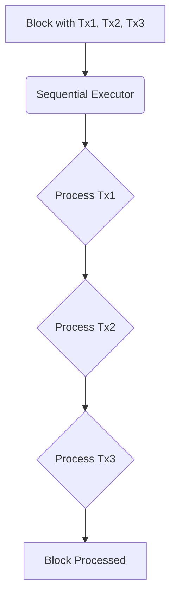
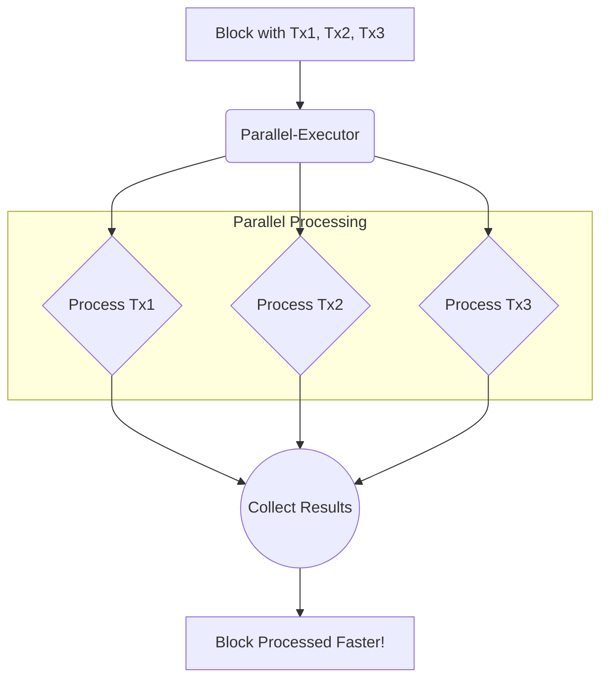
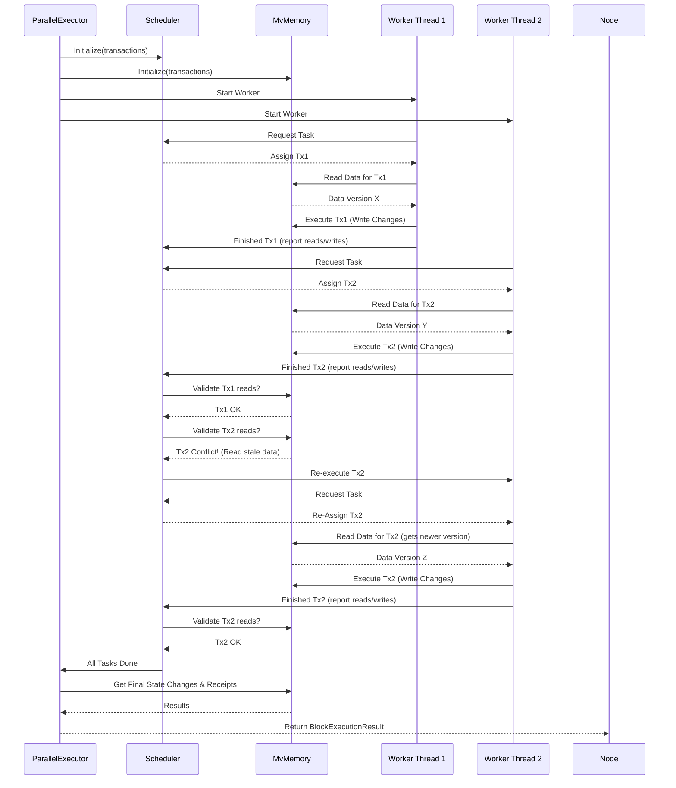

In [Parallel Executor Builder](peb), we learned how to install a special "factory" (`Block-Parallel-Executor-Provider`) into our Reth node. This factory's job is to create the high-performance engine needed for faster transaction processing.

Now, let's meet the engine itself: the `Parallel-Executor`.

## What Problem Does `Parallel-Executor` Solve?

Imagine you have a big block full of blockchain transactions. Normally, a node processes these one by one, like a single toll booth serving a long line of cars. This is safe but can be slow.



**The Bottleneck:** Sequential execution limits how fast we can process blocks, especially when there are many transactions or complex smart contracts involved.

**The Goal:** We want to process multiple transactions _at the same time_ to finish the block faster, like opening multiple toll booths.

**The Engine:** The `Parallel-Executor` is the core component in `metis-sdk` designed to do exactly this. It takes a block of transactions and orchestrates their execution across multiple CPU cores.



Think of the `Parallel-Executor` as the manager of a multi-lane highway. It directs the traffic (transactions) to different lanes (CPU cores) so they can travel simultaneously, increasing the overall speed (throughput).

## How Does Parallel Execution Work (The Idea)?

Executing transactions in parallel sounds great, but it's tricky. Why? Because transactions aren't always independent.

- **Dependency:** Transaction B might need to know the result of Transaction A (e.g., checking an account balance that Transaction A just changed).
- **Conflicts:** Transaction C and Transaction D might try to change the _same_ piece of data (e.g., updating the same storage slot in a smart contract).

Running these concurrently without care could lead to chaos and incorrect results, like cars crashing on our highway!

The `Parallel-Executor` uses clever techniques (with help from friends like the [Scheduler](scheduler) and [MvMemory (Multi-Version Memory)](mvmemory)) to manage this:

1.  **Optimistic Execution:** It often _tries_ to run transactions in parallel, assuming they won't conflict.
2.  **Tracking Changes:** It keeps track of what data each transaction reads and tries to write using [MvMemory (Multi-Version Memory)](mvmemory).
3.  **Detecting Conflicts:** It checks if a transaction read data that was later changed by another transaction that _should_ have run earlier.
4.  **Coordination & Re-execution:** If a conflict is found, the [Scheduler](scheduler) might need to re-run the affected transaction with the correct data.

It's like the highway manager having cameras and radios to detect potential issues and reroute traffic if needed. The goal is maximum speed without compromising safety (correctness).

## How Is `Parallel-Executor` Used?

As a user setting up a node, you typically don't interact with `Parallel-Executor` directly in your `main.rs`. Remember from Chapter 1? We set up the `Block-Parallel-Executor-Provider`.

When the Reth node needs to process a block, it asks the `Block-Parallel-Executor-Provider` factory: "Give me an executor!"

The provider then creates and returns a fresh `Parallel-Executor` instance, ready to go.

Let's revisit the `executor` method within the `Block-Parallel-Executor-Provider` from Chapter 1:

```rust
// -- File: crates/chain/src/provider.rs (Simplified Provider) --

use reth_evm::execute::{BlockExecutorProvider, Executor};
use reth::revm::db::State;
use alloy_evm::Database;
// ... other imports ...

pub struct BlockParallelExecutorProvider {
    strategy_factory: EthEvmConfig, // Configuration
}

// Implementation of the trait Reth uses to get an executor
impl BlockExecutorProvider for BlockParallelExecutorProvider {
    // ... type definitions ...
    type Executor<DB: Database> = ParallelExecutor<DB>; // Specifies the type it provides

    // This is the factory method! Called by Reth.
    fn executor<DB>(&self, db: DB) -> Self::Executor<DB> // Returns our actual ParallelExecutor
    where
        DB: Database, // Requires a database handle
    {
        // Prepare the state database access layer
        let state_db = State::builder()
            .with_database(db)
            // ... other state configurations ...
            .build();

        // *** HERE IT IS! ***
        // Create and return a new instance of the ParallelExecutor!
        // We pass it the configuration and the state database access.
        ParallelExecutor::new(self.strategy_factory.clone(), state_db) // NEW instance created!
    }
}

// Definition of the actual executor (details below)
pub struct ParallelExecutor<DB> { /* ... fields ... */ }
// Implementation of the executor (details below)
impl<DB> ParallelExecutor<DB> {
     pub fn new(strategy_factory: EthEvmConfig, db: State<DB>) -> Self { /* ... */ }
     // ... other methods ...
}
```

**Explanation:**

- The node calls `provider.executor(database_connection)`.
- The `executor` method inside the provider creates a `ParallelExecutor` using `ParallelExecutor::new(...)`.
- It passes necessary things like the EVM configuration (`strategy_factory`) and a way to access the blockchain state (`state_db`).
- It returns this freshly created `ParallelExecutor` instance to the node.
- The node then uses this instance to execute the block's transactions.

So, while we configured the _builder_ in `main.rs`, the _provider_ handles the creation, and the `ParallelExecutor` is the resulting engine that does the heavy lifting.

## Under the Hood: A Peek Inside `ParallelExecutor`

Let's imagine what happens when the node tells the `ParallelExecutor` to execute a block.

**Step-by-Step (Simplified):**

1.  **Receive Task:** The `ParallelExecutor` gets the block data, including the list of transactions.
2.  **Setup Helpers:** It initializes its internal machinery:
    - A [Scheduler](scheduler) to decide which transaction runs next and on which core.
    - An [MvMemory (Multi-Version Memory)](mvmemory) instance to track reads/writes for conflict detection.
3.  **Launch Workers:** It spins up multiple worker threads (usually matching the number of CPU cores available). Think of these as the different lanes on our highway.
4.  **Distribute Work:** The [Scheduler](scheduler) starts assigning transactions to available worker threads.
5.  **Execute & Track:** Each worker thread executes its assigned transaction. As it runs, it records the data it reads and the changes it wants to make in the shared [MvMemory (Multi-Version Memory)](mvmemory).
6.  **Validate & Coordinate:** The [Scheduler](scheduler) and [MvMemory (Multi-Version Memory)](mvmemory) work together. After a transaction finishes, they check if it conflicted with others (e.g., did it read stale data?).
7.  **Handle Conflicts:** If a conflict occurred, the [Scheduler](scheduler) might tell the worker thread to discard its results and re-execute the transaction later, ensuring correctness.
8.  **Collect Results:** Once all transactions have been successfully executed and validated without conflicts, the `ParallelExecutor` gathers the results (like transaction receipts and state changes) from [MvMemory (Multi-Version Memory)](mvmemory).
9.  **Return:** The final, verified results for the entire block are returned to the node.

**Sequence Diagram (Simplified Internal Flow):**



**Diving Deeper into the Code (Simplified):**

Let's look at the structure and key methods involved.

**1. The `ParallelExecutor` Struct:**

This struct holds the state needed for execution. Notice it contains an instance of `metis_pe::ParallelExecutor` - this is the actual implementation from the core parallel execution (`pe`) crate.

```rust
// -- File: crates/chain/src/provider.rs (Simplified Struct Definition) --

use reth::revm::db::State;
use reth_evm_ethereum::EthEvmConfig;
use std::num::NonZeroUsize;
// ... other imports ...

pub struct ParallelExecutor<DB> {
    // EVM configuration (like chain rules)
    strategy_factory: EthEvmConfig,
    // Access to the blockchain state database
    db: State<DB>,
    // *** The actual parallel execution engine from the 'metis-pe' crate ***
    executor: metis_pe::ParallelExecutor,
    // How many threads (CPU cores) to use
    concurrency_level: NonZeroUsize,
}

impl<DB> ParallelExecutor<DB> {
    // Constructor used by the Provider
    pub fn new(strategy_factory: EthEvmConfig, db: State<DB>) -> Self {
        Self {
            strategy_factory,
            db,
            // Create a default instance of the core parallel engine
            executor: metis_pe::ParallelExecutor::default(),
            // Use available CPU cores, default to 1 if detection fails
            concurrency_level: NonZeroUsize::new(num_cpus::get())
                .unwrap_or(NonZeroUsize::new(1).unwrap()),
        }
    }
    // ... other methods like execute_one, execute_block ...
}
```

**Explanation:**

- It stores the EVM config (`strategy_factory`) and database access (`db`).
- Crucially, it holds an `executor` field, which is an instance of `metis_pe::ParallelExecutor`. This delegate does the actual parallel work.
- It determines the `concurrency_level` (how many threads to use) based on system CPUs.

**2. The `execute_one` Method:**

This is the main entry point called by Reth when it wants to execute a single block.

```rust
// -- File: crates/chain/src/provider.rs (Simplified execute_one) --

use reth::providers::BlockExecutionResult;
use reth::primitives::RecoveredBlock;
use reth_evm::execute::Executor;
// ... other imports ...

impl<DB> Executor<DB> for ParallelExecutor<DB>
where
    DB: Database, // Requires DB implements the Database trait
{
    // ... type definitions ...

    // Called by Reth to execute the transactions in a block
    fn execute_one(
        &mut self,
        block: &RecoveredBlock</* ... Block Type ... */>,
    ) -> Result<BlockExecutionResult</* ... Receipt Type ... */>, BlockExecutionError> {

        // 1. Apply initial changes (like EIP-4788 beacon block root)
        // self.apply_pre_execution_changes(block)?; // Simplified away for clarity

        // 2. *** Execute the block's transactions in parallel ***
        let parallel_execute_result = self.execute_block(block)?;

        // 3. Apply final changes (like miner rewards, withdrawals)
        // self.post_execution(block)?; // Simplified away for clarity

        // 4. Finalize state changes
        self.db.merge_transitions(/*...*/);

        // 5. Return the results (receipts, gas used, etc.)
        Ok(parallel_execute_result)
    }

    // ... other methods like into_state, size_hint ...
}
```

**Explanation:**

- This method orchestrates the overall execution of a block.
- It calls helper methods for tasks before and after transaction execution (simplified away here).
- The core step is calling `self.execute_block(block)?` which triggers the parallel execution.
- Finally, it merges the state changes and returns the results.

**3. The `execute_block` Method:**

This method prepares the inputs and calls the core parallel engine.

```rust
// -- File: crates/chain/src/provider.rs (Simplified execute_block) --

use crate::state::StateStorageAdapter; // Adapter for DB access
use metis_primitives::TxEnv; // Transaction environment type
// ... other imports ...

impl<DB> ParallelExecutor<DB>
where
    DB: Database,
{
    // Internal method to run transactions in parallel
    pub fn execute_block(
        &mut self,
        block: &RecoveredBlock</* ... Block Type ... */>,
    ) -> Result<BlockExecutionResult<Receipt>, BlockExecutionError> {

        // Convert Reth transactions into the format needed by metis-pe
        let transactions: Vec<TxEnv> = block
            .transactions_recovered()
            .map(|tx| tx.into_tx_env()) // Conversion step
            .collect();

        // Prepare EVM environment details for the block
        let evm_env = self.strategy_factory.evm_env(block.header());

        // *** Call the core parallel execution engine! ***
        let results = self.executor.execute(
            StateStorageAdapter::new(&mut self.db), // Database access
            evm_env,                              // EVM environment
            transactions,                         // List of transactions
            self.concurrency_level,               // How many threads to use
        );

        // Process results: commit state changes, calculate total gas, collect receipts
        let mut total_gas_used: u64 = 0;
        let receipts = results? // Handle potential errors from execute()
            .into_iter()
            .map(|r| {
                self.db.commit(r.state); // Apply state changes from this tx
                total_gas_used += r.receipt.cumulative_gas_used; // Sum gas (will be fixed later)
                r.receipt
            })
            .collect();

        Ok(BlockExecutionResult { receipts, gas_used: total_gas_used, ..Default::default() })
    }
    // ... other methods like post_execution, calc_requests ...
}
```

**Explanation:**

- It prepares the list of transactions (`transactions`) and the EVM environment (`evm_env`) in the format expected by `metis-pe::ParallelExecutor`.
- It calls `self.executor.execute(...)`, passing the database adapter, EVM environment, transactions, and concurrency level. **This is the heart of the parallel execution process.**
- The `metis-pe::ParallelExecutor` (the `executor` field) takes over, managing threads, the [Scheduler](scheduler), and [MvMemory (Multi-Version Memory)](mvmemory) to run the transactions concurrently.
- After `execute` returns the results for each transaction, this method commits the state changes to the `State` object (`self.db.commit`) and collects the receipts.

## Conclusion

The `Parallel-Executor` is the powerhouse of `metis-sdk`. It's the component responsible for taking a block's transactions and running them concurrently across multiple CPU cores, significantly speeding up block processing compared to traditional sequential execution.

While it seems complex internally, relying on sophisticated coordination mechanisms, its integration into Reth is managed neatly by the `Block-Parallel-Executor-Provider` we saw in Chapter 1. The provider creates the `Parallel-Executor` instance, and the node simply asks it to `execute_one` block.
