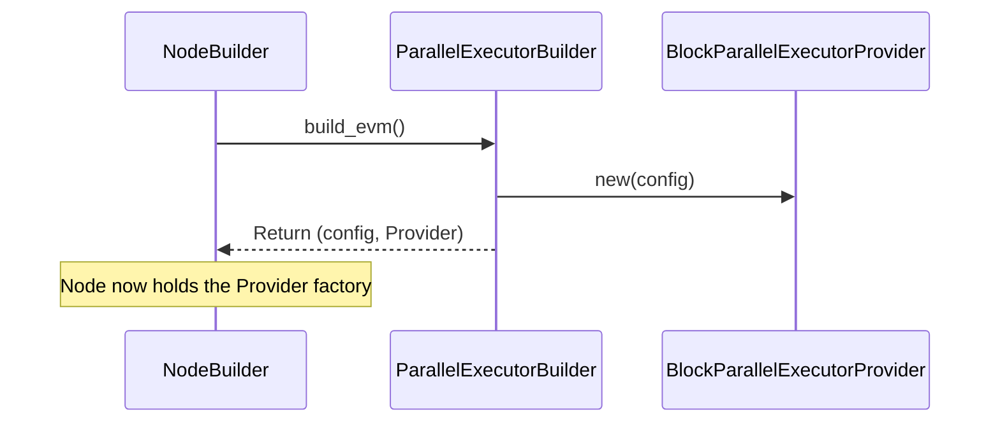

Imagine a standard blockchain node like Reth. When it processes a block full of transactions, it usually handles them one after the other, like a single cashier serving a long queue. This is safe and reliable, but it can be slow, especially when there are many transactions.

What if we could process multiple transactions at the same time, like opening several cashier lanes? That's the core idea behind `metis-sdk`'s parallel execution.

This chapter introduces the first piece of the puzzle: how we _install_ this faster, parallel processing engine into the standard Reth node framework.

## What Problem Are We Solving?

**The Bottleneck:** Standard Ethereum nodes like Reth execute transactions within a block sequentially (one by one). This sequential execution can become a bottleneck, limiting the node's overall performance and transaction processing speed.

**The Goal:** We want to replace Reth's default sequential transaction processor with a much faster _parallel_ processor provided by `metis-sdk`.

**The Tool:** To make this switch, we need a way to tell the Reth node during its setup phase, "Hey, don't use your standard transaction processor; use this special parallel one instead!" This is where `Parallel-Executor-Builder` and `Block-Parallel-Executor-Provider` come in.

Think of it like upgrading a car:

- **Reth Node:** The car chassis and standard systems.
- **Default Executor:** The standard, reliable engine.
- **`metis-sdk`'s `Parallel-Executor`:** A high-performance, multi-cylinder engine (we'll learn more about this in [Parallel Executor](pe)).
- **`Parallel-Executor-Builder`:** The mechanic's toolkit and instructions needed to _install_ the new engine.
- **`Block-Parallel-Executor-Provider`:** The factory that _builds_ and provides the correctly configured high-performance engine whenever the car needs it.

## Meet the Builder and the Provider

1.  **`Parallel-Executor-Builder`:** This is used when you are _building_ or _configuring_ your Reth node. It's like a configuration setting that tells the node builder, "Please prepare to use the parallel execution engine." You interact with this _once_ during setup.

2.  **`Block-Parallel-Executor-Provider`:** This component is created _by_ the `Parallel-Executor-Builder` during setup. Its job is to act as a factory. Whenever the node needs to actually process a block, it asks this provider, "Give me an instance of the execution engine." The provider then creates and returns a ready-to-use [Parallel Executor](pe).

In simple terms:

- The **Builder** sets things up.
- The **Provider** creates the engine on demand.

## How to Use Them: Plugging in the Parallel Engine

Let's see how you tell a Reth node to use the parallel executor. This happens in the main setup file of your node, often called `main.rs`.

```rust
// -- File: crates/chain/bin/main.rs (Simplified) --

use metis_chain::provider::ParallelExecutorBuilder; // Import the builder
use reth::cli::Cli;
use reth_node_ethereum::EthereumNode;
use reth_node_ethereum::node::EthereumAddOns;
// ... other imports ...

fn main() {
    // ... initial setup ...

    if let Err(err) = Cli::parse_args().run(async move |builder, _| {
        let handle = builder
            // Use standard Ethereum node types
            .with_types::<EthereumNode>()
            // *** THIS IS THE KEY PART ***
            // Configure node components
            .with_components(
                // Get default Ethereum components, but...
                EthereumNode::components()
                    // ...replace the executor with our parallel one!
                    .executor(ParallelExecutorBuilder::default()) // Use the builder
            )
            // Add other standard features
            .with_add_ons(EthereumAddOns::default())
            // ... potentially add more extensions like ExEx ...
            .launch() // Start the node
            .await?;

        handle.wait_for_node_exit().await // Keep the node running
    }) {
        eprintln!("Error: {err:?}");
        std::process::exit(1);
    }
}
```

**Explanation:**

- We import `ParallelExecutorBuilder` from `metis_chain::provider`.
- When configuring the node using `.with_components(...)`, we call `.executor(...)`.
- Instead of letting Reth use its default executor, we pass `ParallelExecutorBuilder::default()`. This tells the node builder to use our custom builder for the execution engine part. `default()` gives us a standard configuration for the parallel executor.

That's it! With this one line change, you've instructed your Reth node to install the `metis-sdk` parallel execution engine instead of the default sequential one.

## Under the Hood: What Happens During Setup?

When the node builder sees `ParallelExecutorBuilder::default()`, it doesn't immediately create the final engine. Instead, it uses the builder to prepare the _factory_ (the Provider).

Here's a simplified step-by-step:

1.  **Node Startup:** You run your `main.rs`.
2.  **Configuration:** The `NodeBuilder` processes the configuration, including `.executor(ParallelExecutorBuilder::default())`.
3.  **Builder Called:** The `NodeBuilder` calls the `build_evm` method on our `ParallelExecutorBuilder`.
4.  **Provider Created:** The `build_evm` method creates two things:
    - An EVM configuration object (`EthEvmConfig`).
    - The `BlockParallelExecutorProvider`, configured with the EVM settings.
5.  **Node Ready:** The node finishes building, now equipped with the `BlockParallelExecutorProvider` factory.
6.  **Block Processing Time:** Later, when the node needs to process a block (execute its transactions), it asks the `BlockParallelExecutorProvider`: "I need an executor!"
7.  **Engine Provided:** The `BlockParallelExecutorProvider` uses its `executor` method to create a fresh instance of the actual [Parallel Executor](pe) and gives it to the node.
8.  **Parallel Execution:** The node uses this [Parallel Executor](pe) to execute the block's transactions in parallel.

Let's visualize the setup part:



## Diving Deeper into the Code (Simplified)

Let's look at the relevant code pieces involved in this setup.

**1. The Builder (`ParallelExecutorBuilder`)**

This struct is very simple. Its main job is to implement the `ExecutorBuilder` trait required by Reth, specifically the `build_evm` method.

```rust
// -- File: crates/chain/src/provider.rs (Simplified) --

use reth::builder::{BuilderContext, components::ExecutorBuilder};
use reth::chainspec::ChainSpec;
use reth_evm_ethereum::EthEvmConfig;
// ... other imports ...

#[derive(Debug, Default, Clone, Copy)]
pub struct ParallelExecutorBuilder; // The builder struct itself

impl<Node> ExecutorBuilder<Node> for ParallelExecutorBuilder
// ... some generic type constraints ...
{
    type EVM = EthEvmConfig; // Specifies the type of EVM configuration
    type Executor = BlockParallelExecutorProvider; // Specifies the Provider it will create

    // This method is called by the NodeBuilder during setup
    async fn build_evm(
        self,
        ctx: &BuilderContext<Node>, // Context with chain info
    ) -> eyre::Result<(Self::EVM, Self::Executor)> {
        // 1. Create the EVM configuration based on the chain specification
        let evm_config = EthEvmConfig::new(ctx.chain_spec());

        // 2. Create the Provider, passing the config to it
        let executor_provider = BlockParallelExecutorProvider::new(evm_config.clone());

        // 3. Return the config and the provider
        Ok((evm_config, executor_provider))
    }
}
```

**Explanation:**

- The `ParallelExecutorBuilder` struct itself is empty; its logic is in the `build_evm` function.
- `build_evm` takes the node's context (which includes details like the `ChainSpec`).
- It creates a standard `EthEvmConfig` needed for Ethereum execution.
- It then creates our `BlockParallelExecutorProvider`, giving it the configuration.
- Finally, it returns both the configuration and the newly created provider back to the Reth node builder.

**2. The Provider (`BlockParallelExecutorProvider`)**

This struct holds the configuration and acts as the factory for the actual executor.

```rust
// -- File: crates/chain/src/provider.rs (Simplified) --

use reth_evm::execute::{BlockExecutorProvider, Executor};
use reth::revm::db::State;
use alloy_evm::Database;
// ... other imports ...

#[derive(Debug, Clone)] // It needs to be cloneable
pub struct BlockParallelExecutorProvider {
    // Holds the EVM configuration created by the builder
    strategy_factory: EthEvmConfig,
}

impl BlockParallelExecutorProvider {
    // Simple constructor used by the builder
    pub const fn new(strategy_factory: EthEvmConfig) -> Self {
        Self { strategy_factory }
    }
}

// Implementation of the trait Reth uses to get an executor
impl BlockExecutorProvider for BlockParallelExecutorProvider {
    // ... type definitions ...

    // This is the factory method!
    fn executor<DB>(&self, db: DB) -> ParallelExecutor<DB> // Returns our actual ParallelExecutor
    where
        DB: Database, // Requires a database handle
    {
        // Prepare the state database access layer
        let state_db = State::builder()
            .with_database(db)
            // ... other state configurations ...
            .build();

        // Create and return a new instance of the ParallelExecutor!
        // We pass it the configuration and the state database access.
        ParallelExecutor::new(self.strategy_factory.clone(), state_db)
    }
}

// Forward declaration of the actual executor (details in Chapter 2)
pub struct ParallelExecutor<DB> { /* ... implementation details ... */ }
```

**Explanation:**

- The `BlockParallelExecutorProvider` stores the `EthEvmConfig` it received from the builder.
- It implements the `BlockExecutorProvider` trait required by Reth.
- The key method is `executor`. When the node calls this (passing in a database connection `db`), the provider:
  - Sets up a `State` object to interact with the blockchain's data.
  - Creates a _new instance_ of `ParallelExecutor` (the actual engine from `metis-sdk`).
  - Passes the stored configuration and the state database access to the new `ParallelExecutor`.
  - Returns the ready-to-use `ParallelExecutor`.

## Conclusion

In this chapter, we learned about the crucial first step in integrating `metis-sdk`'s parallel execution capabilities into a Reth node.

- The **`Parallel-Executor-Builder`** is the configuration tool used during node setup. It tells Reth to get ready for a custom execution engine.
- The **`Block-Parallel-Executor-Provider`** is the factory created by the builder. It holds the necessary configuration and creates instances of the actual parallel execution engine whenever the node needs to process a block.

Think of them as the installation kit and the engine factory. They don't do the parallel processing themselves, but they are essential for plugging the high-performance engine into the Reth framework.

Now that we understand how the parallel engine is _installed_ and _provided_ to the node, let's dive into the engine itself in the next chapter!
