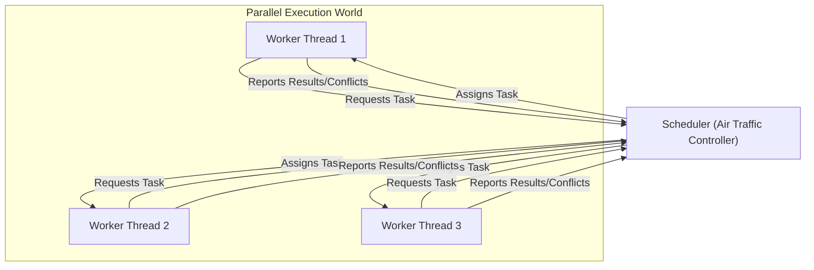
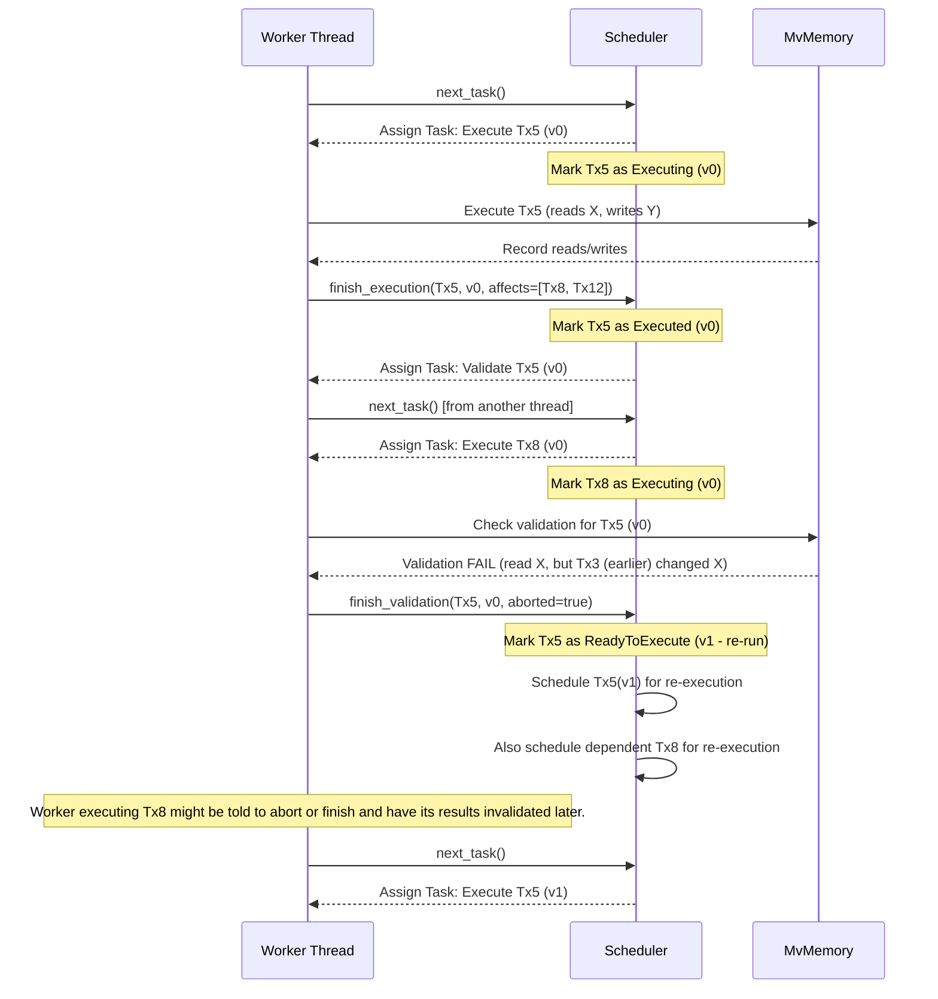

In [Parallel Executor](pe), we met the engine that runs blockchain transactions in parallel. We saw that it uses multiple "workers" (like highway lanes) to process transactions simultaneously. But how does it make sure these workers don't cause chaos? How does it handle transactions that depend on each other or try to change the same data?

That's where the **Scheduler** comes in.

## What Problem Does the Scheduler Solve?

Imagine an airport with multiple runways and many planes (worker threads) wanting to land and take off (execute transactions). Without coordination, planes might try to use the same runway at the same time, miss their required landing sequence, or run into each other! That would be a disaster.

In parallel transaction execution:

- **Dependency:** Transaction B might need a result from Transaction A (like checking an account balance A just updated). B must wait for A to finish correctly.
- **Conflicts:** Transaction C and Transaction D might try to change the _exact same_ piece of data simultaneously (like updating the same counter in a smart contract). This could lead to incorrect results if not managed.

**The Goal:** We need a coordinator to manage the workers, ensure transactions execute in a valid order (even if run in parallel), handle dependencies, and resolve conflicts safely.

**The Solution:** The `Scheduler` acts like the air traffic controller for our parallel execution engine.



The Scheduler decides which transaction a worker should run next, tracks dependencies, and uses information (often from [MvMemory (Multi-Version Memory)](mvmemory)) to detect and handle situations where parallel execution might have gone wrong, sometimes requiring a transaction to be re-run.

## What Does the Scheduler Do?

The Scheduler has several key responsibilities:

1.  **Task Assignment:** It maintains a list of transactions that need to be processed. When a worker thread becomes free, the Scheduler gives it the next available task (usually executing a specific transaction).
2.  **Dependency Tracking:** If Transaction B depends on Transaction A, the Scheduler ensures B doesn't run until A has successfully completed. If A needs to be re-run due to a conflict, B might also need to wait or re-run.
3.  **Status Tracking:** It keeps track of the status of each transaction (e.g., `ReadyToExecute`, `Executing`, `Executed` but needs validation, `Validated`, `Blocking` on another transaction).
4.  **Conflict Handling (Coordination):** When [MvMemory (Multi-Version Memory)](mvmemory) detects a potential conflict (e.g., a transaction read old data), the Scheduler is notified. It then decides the next steps:
    - **Validation:** Mark a transaction as needing validation checks.
    - **Re-execution:** If validation fails or a dependency changes, schedule the transaction (and potentially others that depend on it) to be executed again with updated information.
5.  **Determining Completion:** It knows when all transactions in a block have been successfully executed and validated, signaling that the block processing is complete.

Think of our air traffic controller:

- **Task Assignment:** "Plane 123, you are cleared for runway 2." (Worker 1, execute Tx5)
- **Dependency Tracking:** "Plane 456, hold position. Plane 123 needs to land first." (Worker 2, wait for Tx5 before starting Tx8)
- **Status Tracking:** Knowing which planes are taxiing, taking off, landing, or holding.
- **Conflict Handling:** "Plane 789, go around! Runway is not clear." (Worker 3, abort Tx10 execution and re-attempt later).
- **Completion:** Knowing when all scheduled flights for the hour have safely landed or taken off.

## How Does It Work (Conceptually)?

1.  **Initialization:** When the [Parallel Executor](pe) starts processing a block, it creates a Scheduler, giving it the list of transactions.
2.  **Task Queue:** The Scheduler often starts by putting all transactions into a "ready to execute" state or queue.
3.  **Worker Requests Task:** A free worker thread asks the Scheduler for work using `next_task()`.
4.  **Scheduler Assigns Task:** The Scheduler picks a transaction (based on dependencies and status) and tells the worker to execute it. It marks the transaction as `Executing`.
5.  **Worker Executes:** The worker runs the transaction, recording its reads and writes in [MvMemory (Multi-Version Memory)](mvmemory).
6.  **Worker Reports Back:** The worker finishes and tells the Scheduler (`finish_execution()`), reporting which transactions might be affected by its changes.
7.  **Scheduler Updates Status:** The Scheduler marks the transaction as `Executed`. If the execution might have caused conflicts for _later_ transactions (based on data writes), it might schedule the current transaction for `Validation`.
8.  **Validation (if needed):** A worker might pick up a `Validation` task. It checks (using [MvMemory (Multi-Version Memory)](mvmemory)) if the transaction read any data that has since been changed by an _earlier_ transaction.
9.  **Validation Result:** The worker reports the validation result (`finish_validation()`).
    - **Success:** The Scheduler marks the transaction as `Validated`.
    - **Failure (Conflict):** The Scheduler marks the transaction as `ReadyToExecute` again (potentially with a higher "incarnation" number, meaning it's a re-run) and puts it back in the queue. It might also trigger re-execution for transactions that _depended_ on this failed one.
10. **Dependencies:** If a worker tries to execute a transaction that depends on another (`Blocking` status), the Scheduler might tell it to wait or try another task. When the dependency clears, the Scheduler makes the waiting transaction `ReadyToExecute`.
11. **Completion:** This continues until the Scheduler sees that all transactions have reached the `Validated` state.

**Simplified Interaction Diagram:**



## Under the Hood: A Peek at the Code

The core logic for the Scheduler resides in `crates/pe/src/scheduler.rs`. Let's look at some simplified key parts.

**1. The `Scheduler` Struct:**

This holds the state needed to manage tasks.

```rust
// -- File: crates/pe/src/scheduler.rs (Simplified) --

use crossbeam::queue::ArrayQueue; // A fast queue for tasks
use std::sync::{
    Mutex,
    atomic::{AtomicUsize, Ordering},
};
use smallvec::SmallVec; // Efficient small vector
use crate::{AtomicWrapper, Task, TxIdx, TxStatus, TxVersion, IncarnationStatus};

// Defines how to get the initial set of tasks (e.g., simple list or complex graph)
pub trait TaskProvider { /* ... */ }

#[derive(Debug)]
pub(crate) struct Scheduler<T: TaskProvider> {
    // The provider of transactions (e.g., NormalProvider simply counts 0..N)
    provider: T,
    // Queue for transactions that need re-execution
    execution_queue: ArrayQueue<TxIdx>,
    // Status of each transaction (incarnation #, status like Ready, Executing)
    // Uses atomic wrappers for thread-safe updates.
    transactions_status: Vec<AtomicWrapper<TxStatus>>,
    // Tracks which transactions are waiting on others
    transactions_dependents: Vec<Mutex<SmallVec<[TxIdx; 1]>>>,
    // Counter for how many transactions are fully validated
    num_validated: AtomicUsize,
}
```

**Explanation:**

- `provider`: Gets the initial list/order of tasks.
- `execution_queue`: Holds transactions that need immediate (re-)execution due to conflicts or dependencies resolving.
- `transactions_status`: A key array tracking the current state (`TxStatus`) of every transaction. `AtomicWrapper` allows safe updates from multiple threads.
- `transactions_dependents`: Stores dependency information (e.g., Tx8 depends on Tx5).
- `num_validated`: A counter to quickly check if all transactions are done.

**2. Transaction Status (`TxStatus` and `IncarnationStatus`):**

These enums and structs define the possible states of a transaction during parallel execution.

```rust
// -- File: crates/pe/src/types.rs (Simplified) --

// Possible states for a transaction's current execution attempt
#[derive(PartialEq, Clone, Debug)]
pub enum IncarnationStatus {
    ReadyToExecute = 0, // Waiting to be picked up by a worker
    Executing,          // Currently being run by a worker
    Executed,           // Finished execution, might need validation
    Validated,          // Execution finished and validation passed
    Blocking,           // Waiting for a dependency to finish
}

// Combines the status with the "incarnation" number (how many times it ran)
#[derive(PartialEq, Clone, Debug)]
pub struct TxStatus {
    pub incarnation: usize, // Re-execution count (starts at 0)
    pub status: IncarnationStatus,
}

// Represents a specific execution attempt (Tx index + incarnation number)
#[derive(Clone, Debug, PartialEq)]
pub struct TxVersion {
    pub tx_idx: TxIdx,             // Index in the block (e.g., 5th tx)
    pub tx_incarnation: TxIncarnation, // Attempt number (e.g., 0th, 1st re-run)
}
```

**Explanation:**

- `IncarnationStatus` tracks the lifecycle of a single execution attempt.
- `TxStatus` combines this status with the `incarnation` number to track the overall state across re-executions.
- `TxVersion` uniquely identifies a specific execution attempt.

**3. Getting the Next Task (`next_task`):**

Workers call this to get work.

```rust
// -- File: crates/pe/src/scheduler.rs (Simplified) --

impl<T: TaskProvider> Scheduler<T> {
    pub(crate) fn next_task(&self) -> Option<Task> {
        // 1. Prioritize tasks needing immediate re-execution
        if let Some(tx_idx) = self.execution_queue.pop() {
            if self.try_change_status(tx_idx, IncarnationStatus::ReadyToExecute, IncarnationStatus::Executing) {
                 // ... get incarnation number ...
                 return Some(Task::Execution(TxVersion { tx_idx, tx_incarnation }));
            }
        }

        // 2. Get next task from the initial provider (e.g., next in sequence)
        if let Some(tx_idx) = self.provider.next_task() {
             if self.try_change_status(tx_idx, IncarnationStatus::ReadyToExecute, IncarnationStatus::Executing) {
                 // ... get incarnation number ...
                 return Some(Task::Execution(TxVersion { tx_idx, tx_incarnation }));
            }
        }

        // 3. (Simplified) Maybe look for validation tasks later...

        None // No tasks available right now
    }

    // Helper to safely try and update a transaction's status
    fn try_change_status(&self, tx_idx: TxIdx, from: IncarnationStatus, to: IncarnationStatus) -> bool {
        // ... uses atomic compare-and-swap logic ...
        true // Placeholder
    }
}
```

**Explanation:**

- The scheduler first checks the `execution_queue` for high-priority re-runs.
- If that's empty, it asks the `provider` for the next transaction in the standard sequence.
- It tries to atomically change the status from `ReadyToExecute` to `Executing` to ensure only one worker gets the task.
- It returns a `Task` (either `Execution` or `Validation`).

**4. Finishing Execution (`finish_execution`):**

Called by a worker after executing a transaction version.

```rust
// -- File: crates/pe/src/scheduler.rs (Simplified) --

use crate::FinishExecFlags; // Flags indicating if validation is needed, etc.

impl<T: TaskProvider> Scheduler<T> {
    pub(crate) fn finish_execution(
        &self,
        tx_version: TxVersion,        // Which tx and incarnation just finished
        flags: FinishExecFlags,       // Info like "needs validation"
        affected_txs: Vec<TxIdx>, // List of later TXs potentially affected
    ) -> Option<Task> {

        // Mark provider task as done (for simple providers)
        self.provider.finish_task(tx_version.tx_idx);

        // If this execution affected others, schedule them for re-execution
        for affected_idx in affected_txs {
            self.add_execution_task(affected_idx); // Puts them in the re-run queue
        }

        // Update status: Executing -> Executed (or Validated if no validation needed)
        let needs_validation = flags.contains(FinishExecFlags::NeedValidation);
        let next_status = if needs_validation { IncarnationStatus::Executed } else { IncarnationStatus::Validated };
        self.update_status(tx_version.tx_idx, tx_version.tx_incarnation, next_status);

        if !needs_validation {
            self.num_validated.fetch_add(1, Ordering::Relaxed); // Increment validated count
        }

        // Resume any transactions that were blocked waiting for this one
        self.resume_dependents(tx_version.tx_idx);

        // If validation is needed, return a Validation task
        if needs_validation {
            Some(Task::Validation(tx_version.tx_idx))
        } else {
            None
        }
    }

    // Helper to add a task to the high-priority re-run queue
    fn add_execution_task(&self, tx_idx: TxIdx) { /* ... */ }
    // Helper to update status safely
    fn update_status(&self, tx_idx: TxIdx, incarnation: usize, status: IncarnationStatus) { /* ... */ }
    // Helper to make dependent tasks ReadyToExecute
    fn resume_dependents(&self, tx_idx: TxIdx) { /* ... */ }
}
```

**Explanation:**

- Notes that the original task (if from the provider) is done.
- Crucially, schedules `affected_txs` (transactions that might have read data written by this `tx_version`) for re-execution. This is a key part of handling conflicts proactively.
- Updates the status of the finished `tx_version` to `Executed` or `Validated`.
- If `Validated`, increments the completion counter.
- Resumes any transactions that were explicitly waiting (`Blocking`) on this one.
- Returns a `Validation` task if required by the `flags`.

**5. Finishing Validation (`finish_validation`):**

Called by a worker after checking if an executed transaction read stale data.

```rust
// -- File: crates/pe/src/scheduler.rs (Simplified) --

impl<T: TaskProvider> Scheduler<T> {
    pub(crate) fn finish_validation(&self, tx_idx: TxIdx, aborted: bool) -> Option<Task> {
        let tx_status = self.get_status(tx_idx); // Get current status

        // Only act if the status is still 'Executed' (otherwise it was already re-run)
        if tx_status.status == IncarnationStatus::Executed {
            if aborted {
                // Validation FAILED! Schedule for re-execution with incremented incarnation.
                if self.try_change_status_to_rerun(tx_idx, tx_status.incarnation) {
                    // Return the new execution task
                    return Some(Task::Execution(TxVersion {
                        tx_idx,
                        tx_incarnation: tx_status.incarnation + 1,
                    }));
                }
            } else {
                // Validation PASSED! Mark as Validated.
                if self.try_change_status(tx_idx, IncarnationStatus::Executed, IncarnationStatus::Validated) {
                    self.num_validated.fetch_add(1, Ordering::Relaxed);
                }
            }
        }
        None // No immediate task generated
    }

    // Helper to get current status
    fn get_status(&self, tx_idx: TxIdx) -> TxStatus { /* ... */ TxStatus { incarnation: 0, status: IncarnationStatus::ReadyToExecute } }
    // Helper to safely change status for re-run
    fn try_change_status_to_rerun(&self, tx_idx: TxIdx, current_incarnation: usize) -> bool { /* ... */ true }
}
```

**Explanation:**

- Checks if the validation result (`aborted`) means the transaction needs re-running.
- If `aborted` is true (validation failed), it tries to atomically change the status back to `ReadyToExecute` but increments the `incarnation` number. If successful, it returns a _new_ `Execution` task for this next attempt.
- If `aborted` is false (validation passed), it tries to change the status to `Validated` and increments the completion counter.

## Conclusion

The Scheduler is the brain coordinating the workers in the [Parallel-Executor](pe). Like an air traffic controller, it assigns tasks (execution, validation), tracks dependencies, manages the status of each transaction, and orchestrates re-execution when conflicts arise. It works closely with other components, especially the one we'll explore next, to get the information needed to detect those conflicts.

Without the Scheduler, parallel execution would be chaotic and likely produce incorrect results. It ensures that even though transactions run concurrently, the final outcome is the same as if they had run one by one, just much faster!

But how does the Scheduler _know_ when a conflict happens? How does it know what data a transaction read or wrote? That requires a special way of handling memory, which leads us to our next topic.
