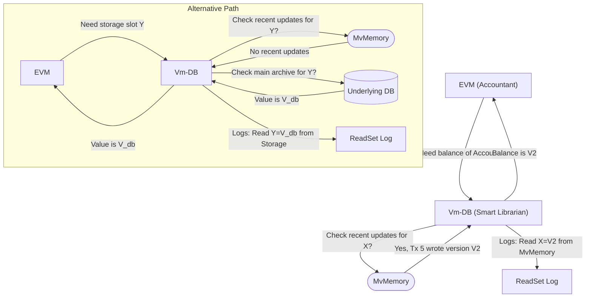
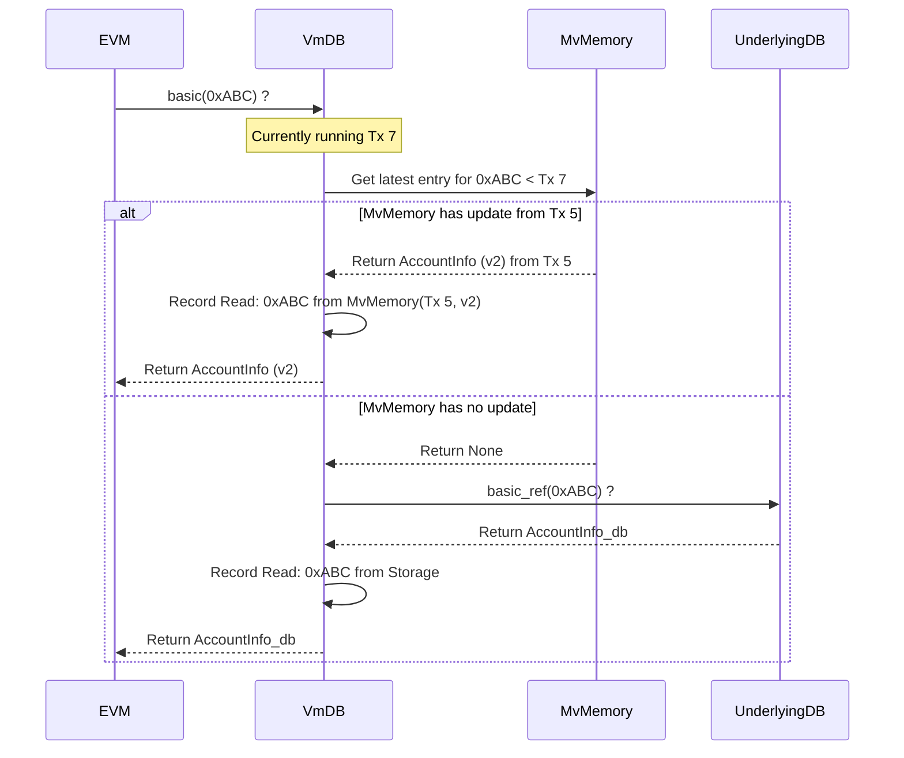

In [MvMemory (Multi-Version Memory)](mvmemory), we learned about the special memory system, `MvMemory`, that tracks different versions of blockchain data as parallel transactions propose changes. It's like a smart scratchpad that helps detect when transactions might conflict.

But how does the actual transaction execution engine (the EVM - Ethereum Virtual Machine) _use_ this multi-versioned data? When a transaction needs to read an account balance, it can't just ask the main blockchain database directly, because a transaction that _should_ run earlier might have already proposed a change in `MvMemory`. How does the EVM get the _right_ value, and how do we remember exactly what it looked at?

This is where `Vm-DB` comes in.

## What Problem Does Vm-DB Solve?

Imagine the EVM as a very precise accountant executing the instructions in a transaction. To do its job, it constantly needs to look up information: "What's the balance of account X?", "What's the value stored at location Y in contract Z?".

In a normal, sequential blockchain, the accountant just looks up the latest value in the main ledger (the blockchain database). Simple.

But in our parallel world:

- **Stale Data Risk:** The main ledger might be out of date if an earlier transaction (running in parallel) has already updated a value in [MvMemory (Multi-Version Memory)](mvmemory). The accountant needs the _latest_ value relevant to its position in the transaction order.
- **Need for Tracking:** To ensure correctness later, we need to know _exactly_ which pieces of information the accountant looked up during its work. If any of that information changes later (because an earlier transaction re-runs), we know the accountant's work might be invalid.

**The Goal:** We need a special helper for the EVM accountant that:

1.  Intercepts all requests for information (state reads).
2.  Fetches the correct version of the information, checking the fast `MvMemory` cache first before going to the main ledger (database).
3.  Keeps a precise log (the `ReadSet`) of everything the accountant looked up and where it found it (which version in `MvMemory` or if it came from the main ledger).

**The Solution:** `Vm-DB` is this specialized helper. It acts as a dedicated database interface _just for the EVM_ during a transaction's execution within the parallel engine.

**Analogy: The Smart Librarian**

Think of the EVM as a researcher needing books (blockchain state). `Vm-DB` is the smart librarian assisting the researcher.

- **Researcher asks:** "I need the latest population figure for London." (EVM requests account balance)
- **Librarian checks:** First, the librarian looks at a "recently updated reports" shelf (`MvMemory`). If the London report is there, they provide that version. (Vm-DB checks `MvMemory` for a recent write by an earlier transaction).
- **Librarian checks archive:** If it's not on the recent shelf, the librarian goes to the main archive (underlying database) to find the figure. (Vm-DB falls back to the main DB).
- **Librarian logs:** Crucially, the librarian notes down _exactly_ which report (which version or from the archive) the researcher looked at. ("Researcher consulted London report, version July 2024 from recent shelf"). This log is the `ReadSet`.



## Key Concepts of Vm-DB

1.  **Database Interface:** `Vm-DB` is designed to look and feel exactly like a standard database to the EVM. It implements the `Database` trait that `revm` (the EVM implementation used) expects. This allows it to seamlessly plug into the execution process.
2.  **State Read Interception:** It sits between the EVM and the actual data sources. Every time the EVM tries to read state (e.g., `basic(address)`, `storage(address, index)`), the request goes to `Vm-DB` first.
3.  **Version Resolution:** When `Vm-DB` receives a read request (e.g., for account X's balance), it asks [MvMemory (Multi-Version Memory)](mvmemory): "What's the latest version of account X written by a transaction with an index _lower_ than the one I'm currently working for?".
    - If `MvMemory` has such a version, `Vm-DB` uses that value.
    - If `MvMemory` doesn't have a relevant version, `Vm-DB` asks the underlying, persistent blockchain database for the value.
4.  **ReadSet Tracking:** Every time `Vm-DB` successfully provides a value to the EVM, it records _how_ it got that value. Did it come from `MvMemory` (and if so, which specific transaction version)? Or did it come from the underlying `Storage`? This record is collected into the `ReadSet`.

## How is Vm-DB Used?

You, as a user of `metis-sdk`, generally don't create or interact with `Vm-DB` directly. It's an internal component used by the parallel execution machinery. Here's the flow:

1.  **Execution Start:** The [ParallelExecutor](pe) needs to run a specific transaction attempt (let's say Tx 7, version 0).
2.  **Vm-DB Creation:** An internal helper (`Vm`) creates a _fresh instance_ of `Vm-DB` specifically for this execution attempt (Tx 7, v0). This `Vm-DB` is given access to [MvMemory (Multi-Version Memory)](mvmemory) and the underlying database.
3.  **EVM Setup:** The `Vm-DB` instance is passed to the `revm` EVM instance that will run Tx 7.
4.  **Execution:** The EVM executes Tx 7's code. Whenever the code requires reading state, the EVM calls methods on the `Vm-DB` instance it was given (e.g., `vmdb.basic(address)`).
5.  **State Lookup & Logging:** `Vm-DB` performs the version resolution (checking `MvMemory` then the DB) and logs the read origin into its internal `ReadSet`.
6.  **Execution Finish:** Tx 7 finishes executing.
7.  **ReadSet Used:** The `Vm-DB` instance now holds the complete `ReadSet` for Tx 7's execution attempt. This `ReadSet` is then extracted and passed to [MvMemory (Multi-Version Memory)](mvmemory)'s `record` function to update the memory state and potentially trigger validation or re-execution of other transactions.

Essentially, `Vm-DB` is a temporary, specialized tool created for each transaction run, enabling correct state access in the parallel environment and recording the necessary information for validation.

## Under the Hood: A Peek Inside Vm-DB

Let's trace what happens when the EVM, running Tx 7, asks `Vm-DB` for the balance of account `0xABC`.

**Step-by-Step:**

1.  **EVM Call:** `revm` calls `vmdb.basic(0xABC)`.
2.  **Vm-DB Calculation:** `Vm-DB` calculates the unique hash for the "basic info" of account `0xABC`. Let's call this `hash_ABC`.
3.  **Vm-DB asks MvMemory:** `Vm-DB` queries the `data` map inside [MvMemory (Multi-Version Memory)](mvmemory) using `hash_ABC`. It asks specifically for the latest entry written by a transaction with `tx_idx < 7`.
4.  **Scenario A: MvMemory Hit:**
    - `MvMemory` finds that Tx 5 (which is `< 7`) wrote version `v2` for `hash_ABC`.
    - `Vm-DB` receives this information (`TxVersion{ tx_idx: 5, tx_incarnation: 2 }` and the associated value `AccountInfo{...}`).
    - `Vm-DB` adds `ReadOrigin::MvMemory(TxVersion{ tx_idx: 5, tx_incarnation: 2 })` to its internal `read_set` for `hash_ABC`.
    - `Vm-DB` returns the `AccountInfo` value to the EVM.
5.  **Scenario B: MvMemory Miss:**
    - `MvMemory` finds no entry for `hash_ABC` written by a transaction before Tx 7.
    - `Vm-DB` then queries the _underlying_ blockchain database: `main_db.basic_ref(0xABC)`.
    - The main DB returns the current `AccountInfo` stored on-chain.
    - `Vm-DB` adds `ReadOrigin::Storage` to its internal `read_set` for `hash_ABC`.
    - `Vm-DB` returns the `AccountInfo` from the main DB to the EVM.
6.  **EVM Continues:** The EVM receives the `AccountInfo` and continues executing the transaction.

**Simplified Sequence Diagram:**



## Diving Deeper into the Code (Simplified)

The `Vm-DB` struct and its logic are primarily found in `crates/pe/src/vm.rs`.

**1. The `Vm-DB` Struct:**

```rust
// -- File: crates/pe/src/vm.rs (Simplified Vm-DB struct) --

use crate::{ReadSet, TxIdx, TxVersion, Vm, ReadOrigin, MemoryLocationHash};
use revm::{Database, DatabaseRef};
use metis_primitives::BuildIdentityHasher;
use hashbrown::HashMap;
use revm::primitives::{Address, AccountInfo, Bytecode, B256, U256};
use smallvec::SmallVec;

// Database interface that intercepts reads for a specific transaction
struct VmDB<'a, DB: DatabaseRef> {
    // Reference to the parent Vm, which holds refs to MvMemory, DB, etc.
    vm: &'a Vm<'a, DB>,
    // Index of the transaction this Vm-DB instance is working for
    tx_idx: TxIdx,
    // Transaction environment details
    tx: &'a revm::primitives::TxEnv,
    // Hashes for sender/receiver (optimization)
    from_hash: MemoryLocationHash,
    to_hash: Option<MemoryLocationHash>,
    // *** The ReadSet being built for this transaction execution ***
    read_set: ReadSet,
    // Cache of accounts read during execution (optimization)
    read_accounts: HashMap<MemoryLocationHash, AccountMeta, BuildIdentityHasher>,
    // Flag for lazy updates (performance optimization, ignore for now)
    is_lazy: bool,
    // ... other fields ...
}

impl<'a, DB: DatabaseRef> VmDB<'a, DB> {
    // Helper to create a new Vm-DB instance for a transaction
    fn new(
        vm: &'a Vm<'a, DB>,
        tx_idx: TxIdx,
        tx: &'a revm::primitives::TxEnv,
        // ... other args ...
    ) -> Result<Self, ReadError> {
        /* ... initialization logic ... */
        Ok(Self {
            vm,
            tx_idx,
            tx,
            from_hash: hash_deterministic(MemoryLocation::Basic(tx.caller)),
            to_hash: tx.kind.to().map(|to| hash_deterministic(MemoryLocation::Basic(*to))),
            read_set: ReadSet::with_capacity_and_hasher(2, BuildIdentityHasher::default()),
            read_accounts: HashMap::with_capacity_and_hasher(2, BuildIdentityHasher::default()),
            is_lazy: false, // Simplified
        })
    }

    // Helper to add a read origin to the read_set, checking for consistency
    fn push_origin(read_origins: &mut SmallVec<[ReadOrigin; 1]>, origin: ReadOrigin) -> Result<(), ReadError> {
        // (Simplified) Adds the origin, potentially checking against previous reads
        read_origins.push(origin);
        Ok(())
    }
}
```

**Explanation:**

- Holds references (`vm`) needed to access [MvMemory (Multi-Version Memory)](mvmemory) (`vm.mv_memory`) and the underlying database (`vm.db`).
- Knows which transaction it's working for (`tx_idx`).
- Crucially, contains the `read_set` it's building.
- Other fields are mostly for context or internal optimizations.

**2. Implementing the `Database` Trait (Simplified `basic` method):**

This is where `Vm-DB` intercepts the EVM's requests.

```rust
// -- File: crates/pe/src/vm.rs (Simplified 'basic' method) --

use crate::{MemoryEntry, MemoryValue, ReadError};
use revm::primitives::AccountInfo;
use revm::context::DBErrorMarker;

// Mark ReadError as a valid DB error type for revm
impl DBErrorMarker for ReadError {}

impl<'a, DB: DatabaseRef> Database for VmDB<'a, DB> {
    type Error = ReadError; // Define the error type

    fn basic(&mut self, address: Address) -> Result<Option<AccountInfo>, Self::Error> {
        // Calculate the unique hash for this account's basic info
        let location_hash = self.hash_basic(&address); // Helper method

        // Get or create the list of read origins for this location in our ReadSet
        let read_origins = self.read_set.entry(location_hash).or_default();

        let mut final_account: Option<AccountInfo> = None;

        // 1. --- Check MvMemory first ---
        if self.tx_idx > 0 { // Only check if not the first tx
            // Access MvMemory data via the 'vm' reference
            if let Some(written_transactions) = self.vm.mv_memory.data.get(&location_hash) {
                // Find the latest entry written *before* our current tx_idx
                if let Some((closest_idx, entry)) =
                    written_transactions.range(..self.tx_idx).next_back()
                {
                    match entry {
                        MemoryEntry::Data(tx_incarnation, MemoryValue::Basic(basic_info)) => {
                            // Found a version in MvMemory!
                            let origin = ReadOrigin::MvMemory(TxVersion {
                                tx_idx: *closest_idx,
                                tx_incarnation: *tx_incarnation,
                            });
                            // Record this read
                            Self::push_origin(read_origins, origin)?;
                            final_account = Some(basic_info.clone());
                        }
                        MemoryEntry::Estimate => {
                            // Found an 'Estimate' - means we need to wait (blocking)
                            return Err(ReadError::Blocking(*closest_idx));
                        }
                        _ => { /* Handle other MemoryValue types or errors */ }
                    }
                }
            }
        }

        // 2. --- Fallback to Underlying DB if not found in MvMemory ---
        if final_account.is_none() {
            // Record that we are reading from storage
            Self::push_origin(read_origins, ReadOrigin::Storage)?;
            // Access the underlying DB via the 'vm' reference
            match self.vm.db.basic_ref(address) {
                Ok(Some(basic_from_db)) => {
                    final_account = Some(basic_from_db);
                }
                Ok(None) => { /* Account doesn't exist in DB */ }
                Err(db_err) => return Err(ReadError::StorageError(db_err.to_string())),
            }
        }

        // 3. --- Perform Checks & Return ---
        if let Some(ref account) = final_account {
            // (Simplified) Check nonce validity if it's the sender account
            if location_hash == self.from_hash && self.tx.nonce != account.nonce {
                return Err(ReadError::InvalidNonce(self.tx_idx));
            }
        }

        Ok(final_account)
    }

    // --- Simplified 'storage' method ---
    fn storage(&mut self, address: Address, index: U256) -> Result<U256, Self::Error> {
        let location_hash = hash_deterministic(MemoryLocation::Storage(address, index));
        let read_origins = self.read_set.entry(location_hash).or_default();
        let mut final_value: Option<U256> = None;

        // 1. Check MvMemory
        if self.tx_idx > 0 {
           if let Some(written_txs) = self.vm.mv_memory.data.get(&location_hash) {
               if let Some((idx, entry)) = written_txs.range(..self.tx_idx).next_back() {
                   // (Simplified) Handle MemoryEntry::Data(_, MemoryValue::Storage(value))
                   // Record ReadOrigin::MvMemory(...)
                   // Set final_value
               }
           }
        }

        // 2. Fallback to DB
        if final_value.is_none() {
            // Record ReadOrigin::Storage
            match self.vm.db.storage_ref(address, index) {
                 Ok(value_from_db) => final_value = Some(value_from_db),
                 Err(e) => return Err(ReadError::StorageError(e.to_string())),
            }
        }

        Ok(final_value.unwrap_or_default()) // Return found value or default (0)
    }

    // Implement other Database trait methods (code_by_hash, block_hash)...
    fn code_by_hash(&mut self, _code_hash: B256) -> Result<Bytecode, Self::Error> { /* ... */ Ok(Bytecode::default()) }
    fn block_hash(&mut self, _number: u64) -> Result<B256, Self::Error> { /* ... */ Ok(B256::default()) }
}
```

**Explanation:**

- The code implements the `Database` trait required by `revm`.
- Inside `basic` (and similarly `storage`), it first calculates the `location_hash`.
- It checks `self.vm.mv_memory.data` for relevant entries written by transactions _before_ `self.tx_idx`.
- If a suitable entry is found, it records the `ReadOrigin::MvMemory` in the `read_set` and uses that value.
- If no entry is found, it falls back to `self.vm.db` (the underlying database), records `ReadOrigin::Storage`, and uses that value.
- It performs essential checks (like nonce validation for the sender).
- The `storage` method follows a very similar pattern for reading storage slots.

## Conclusion

`Vm-DB` is the essential intermediary that allows the standard EVM execution engine (`revm`) to work correctly within the `metis-sdk` parallel execution environment. It acts like a smart librarian, ensuring the EVM reads the appropriate version of any state data by checking the fast [MvMemory (Multi-Version Memory)](mvmemory) cache before the main database archive.

Crucially, it meticulously logs every piece of data the EVM reads (`ReadSet`), providing the necessary information for the [Scheduler](scheduler) and [MvMemory (Multi-Version Memory)](mvmemory) to validate the execution attempt later and handle any conflicts that arise from parallel operations.

We've now seen how transactions are scheduled, how their state changes are managed in a multi-versioned way, and how the EVM interacts with this system via `Vm-DB`. What about making the EVM execution itself even faster? Let's explore how compilation can help.
