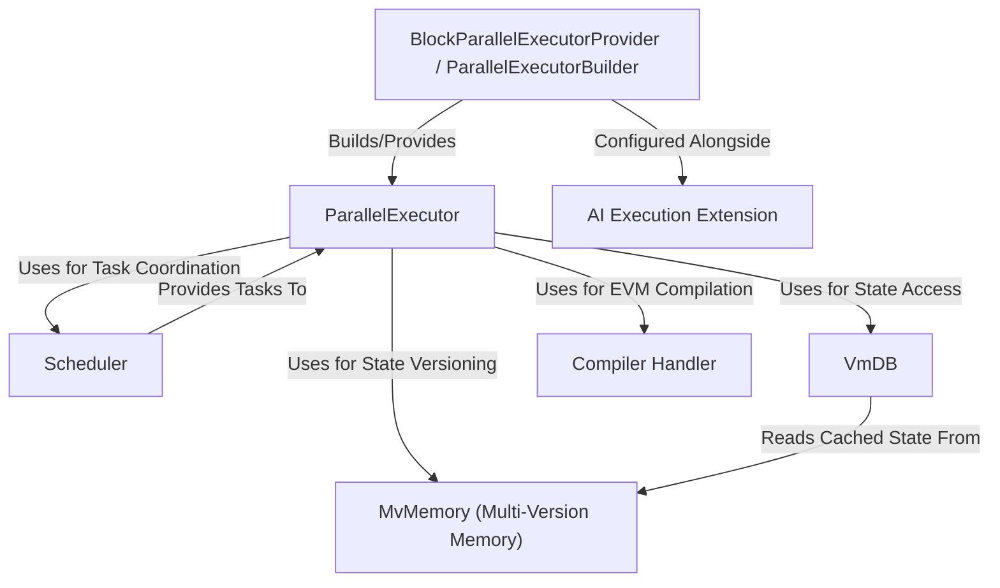
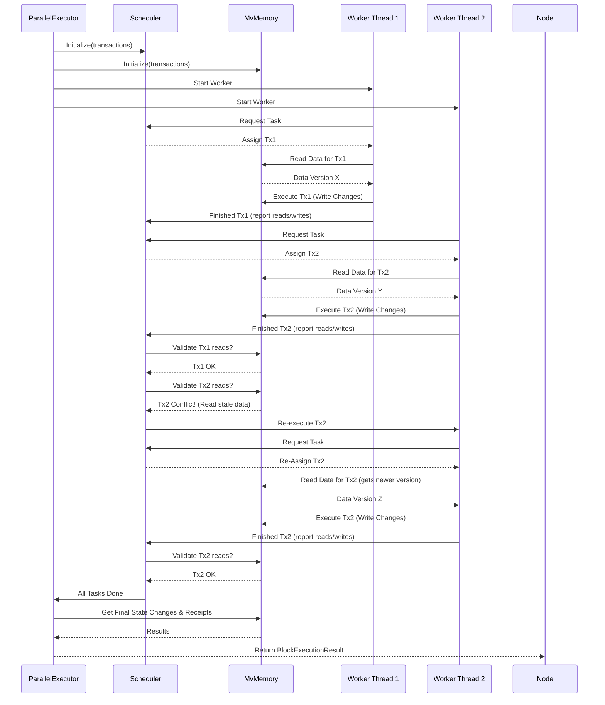
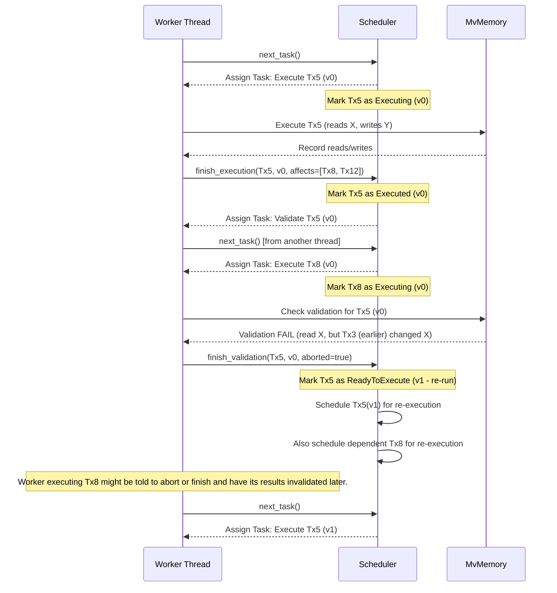

Metis Parallel Executor implements **parallel execution of Ethereum Virtual Machine (EVM) transactions** using a **Block-STM** mechanism. It guarantees that, under a given transaction order, the final state and outputs are **deterministically consistent** with serial execution. Designed for high throughput and efficiency.

## Key Features

- **Deterministic Parallel Execution**: Ensures outputs are consistent with serial execution under a fixed order.
- **Optimized Scheduler**: Efficiently schedules transactions to minimize re-execution and re-validation.
- **Pre-execution Analysis**: Utilizes transaction dependency graphs for better conflict avoidance.
- **Lock-Free Data Structures**: Improves throughput by reducing lock contention.
- **Multi-Versioned Memory (MVMemory)**: Provides STM-style isolation with per-transaction versioning of state.

## Architecture Overview

### Executor

- Entry point for executing a block of transactions.
- Supports **serial** and **parallel** execution modes.
- Delegates transaction scheduling, execution, validation, and finalization.

Let's imagine what happens when the node tells the `ParallelExecutor` to execute a block.

**Step-by-Step (Simplified):**

1.  **Receive Task:** The `ParallelExecutor` gets the block data, including the list of transactions.
2.  **Setup Helpers:** It initializes its internal machinery:
    - A Scheduler to decide which transaction runs next and on which core.
    - A MvMemory (Multi-Version Memory) instance to track reads/writes for conflict detection.
3.  **Launch Workers:** It spins up multiple worker threads (usually matching the number of CPU cores available). Think of these as the different lanes on our highway.
4.  **Distribute Work:** The Scheduler starts assigning transactions to available worker threads.
5.  **Execute & Track:** Each worker thread executes its assigned transaction. As it runs, it records the data it reads and the changes it wants to make in the shared MvMemory.
6.  **Validate & Coordinate:** The Scheduler and MvMemory work together. After a transaction finishes, they check if it conflicted with others (e.g., did it read stale data?).
7.  **Handle Conflicts:** If a conflict occurred, the Scheduler might tell the worker thread to discard its results and re-execute the transaction later, ensuring correctness.
8.  **Collect Results:** Once all transactions have been successfully executed and validated without conflicts, the `ParallelExecutor` gathers the results (like transaction receipts and state changes) from MvMemory.
9.  **Return:** The final, verified results for the entire block are returned to the node.

**Sequence Diagram (Simplified Internal Flow):**

### Scheduler

The Scheduler has several key responsibilities:

1.  **Task Assignment:** It maintains a list of transactions that need to be processed. When a worker thread becomes free, the Scheduler gives it the next available task (usually executing a specific transaction).
2.  **Dependency Tracking:** If Transaction B depends on Transaction A, the Scheduler ensures B doesn't run until A has successfully completed. If A needs to be re-run due to a conflict, B might also need to wait or re-run.
3.  **Status Tracking:** It keeps track of the status of each transaction (e.g., `ReadyToExecute`, `Executing`, `Executed` but needs validation, `Validated`, `Blocking` on another transaction).
4.  **Conflict Handling (Coordination):** When MvMemory detects a potential conflict (e.g., a transaction read old data), the Scheduler is notified. It then decides the next steps:
    - **Validation:** Mark a transaction as needing validation checks.
    - **Re-execution:** If validation fails or a dependency changes, schedule the transaction (and potentially others that depend on it) to be executed again with updated information.
5.  **Determining Completion:** It knows when all transactions in a block have been successfully executed and validated, signaling that the block processing is complete.

Think of our air traffic controller:

- **Task Assignment:** "Plane 123, you are cleared for runway 2." (Worker 1, execute Tx5)
- **Dependency Tracking:** "Plane 456, hold position. Plane 123 needs to land first." (Worker 2, wait for Tx5 before starting Tx8)
- **Status Tracking:** Knowing which planes are taxiing, taking off, landing, or holding.
- **Conflict Handling:** "Plane 789, go around! Runway is not clear." (Worker 3, abort Tx10 execution and re-attempt later).
- **Completion:** Knowing when all scheduled flights for the hour have safely landed or taken off.

**Simplified Interaction Diagram:**

### MVMemory

`MvMemory` acts as an intermediary between the parallel transactions and the actual blockchain state. It keeps track of multiple "versions" of data items (like the amount of flour) as different transactions propose changes.

Think of it like a collaborative document (like Google Docs):

- Multiple people can view the document (read state).
- Multiple people can type suggestions simultaneously (propose writes).
- The system tracks each person's changes (versions).
- If two people edit the _exact same sentence_ at the same time, the system might flag it as a conflict that needs resolving.

`MvMemory` manages shared data by keeping multiple versions:

1.  **Reading Data:** When a transaction (Chef A) needs to read a piece of data (flour amount), `MvMemory` looks up the location (pantry shelf for flour). It finds the latest version written by a transaction that _comes before_ Chef A in the original block order and has already been _successfully executed_ (or the initial state if no one before A touched it). Chef A records _which version_ they read.
2.  **Writing Data:** When Chef A finishes and wants to update the flour amount, they don't directly change the main value. Instead, they tell `MvMemory`: "I, Chef A, propose a new version for flour amount: 0.5." `MvMemory` stores this as a _potential_ update associated specifically with Chef A's transaction index.
3.  **Tracking Versions:** `MvMemory` maintains a history for each data location. For "flour amount", it might look like:
    - Initial State: 1
    - Tx 5 proposes: 0.8 (after using 0.2)
    - Tx 12 proposes: 0.7 (after using 0.1 based on Tx 5's version)
    - Tx 7 proposes: 0.5 (after using 0.5 based on the initial state)
4.  **Detecting Conflicts (Validation):** This is crucial. Let's say Tx 7 read the "Initial State: 1" version of flour. Later, the Scheduler asks `MvMemory` to validate Tx 7. `MvMemory` checks: "Did any transaction _before_ Tx 7 (like Tx 5) write a new version of flour _after_ Tx 7 read the initial state?" In our example, yes! Tx 5 wrote "0.8". This means Tx 7's read ("Initial State: 1") was stale by the time Tx 5 finished. `MvMemory` reports this conflict back to the Scheduler, which will likely tell Tx 7 to re-execute using the correct data.

### VmDB

Key Concepts of VmDB

1.  **Database Interface:** `VmDB` is designed to look and feel exactly like a standard database to the EVM. It implements the `Database` trait that `revm` (the EVM implementation used) expects. This allows it to seamlessly plug into the execution process.
2.  **State Read Interception:** It sits between the EVM and the actual data sources. Every time the EVM tries to read state (e.g., `basic(address)`, `storage(address, index)`), the request goes to `VmDB` first.
3.  **Version Resolution:** When `VmDB` receives a read request (e.g., for account X's balance), it asks MvMemory: "What's the latest version of account X written by a transaction with an index _lower_ than the one I'm currently working for?".
    - If `MvMemory` has such a version, `VmDB` uses that value.
    - If `MvMemory` doesn't have a relevant version, `VmDB` asks the underlying, persistent blockchain database for the value.
4.  **ReadSet Tracking:** Every time `VmDB` successfully provides a value to the EVM, it records _how_ it got that value. Did it come from `MvMemory` (and if so, which specific transaction version)? Or did it come from the underlying `Storage`? This record is collected into the `ReadSet`.
