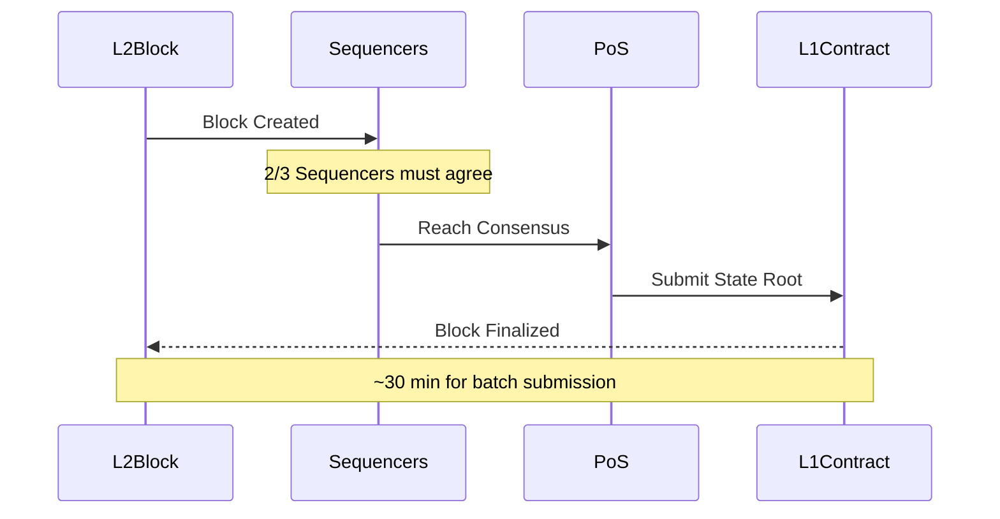

import { Step, Steps } from "fumadocs-ui/components/steps";
import { Callout } from "fumadocs-ui/components/callout";



This document outlines the process and methodologies used to obtain the finalized block number in the Metis chain environment. It specifically addresses the retrieval methods via Layer 2 (L2) RPC and Layer 1 (L1) Smart Contract (SCC) checks, along with the operational timings for batch submissions.

## Definitions

`mvm_finalizedBlockNumber`: The block number in the Layer 2 blockchain that has been finalized after the sequencer rotation and can no longer be reorganized when 2/3 of sequencers reach consensus.

`eth_getBlockByNumber`: This is the standard Ethereum JSON-RPC method used to retrieve block information, including the finalized block number.

## Steps to Retrieve Latest Finalized Block Number

To obtain the latest ‘`eth_getBlockByNumber`’, you can query through any healthy Layer 2 RPC.

<Callout type="info">
  Ensure your RPC client handles updates dynamically to reflect changes
  post-sequencer rotations.
</Callout>

<Steps>
  <Step>Connect to the L2 RPC.</Step>
  <Step>
    Execute the ‘`eth_getBlockByNumber`’ method with the parameter
    "`finalized`“, similar to how you would use “`latest`”. This instructs the
    RPC to return the latest finalized block.
    Example JSON-RPC request:

```json
{
  "jsonrpc": "2.0",
  "method": "eth_getBlockByNumber",
  "params": ["finalized", true],
  "id": 1
}
```

  </Step>
</Steps>
