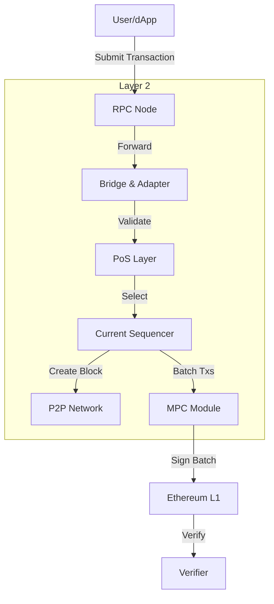

import { Card, Cards } from "fumadocs-ui/components/card";

With the introduction of Decentralized Sequencers, Metis aims to achieve full decentralization of its Layer 2 networks, overcoming the limitations of traditional centralized sequencers. This system is designed to enhance security, scalability, and transparency while ensuring fault tolerance and efficient transaction ordering.

We have launched a Decentralized Sequencer Pool to achieve full decentralization in Layer 2 networks and avoid the single-point failures derived from centralized sequencers. This is a key step towards making our L2 network fully decentralized. It works with our existing decentralized P2P network to enable smooth and secure sequencer transitions, and the removal of faulty or malicious nodes. This ensures the network's long-term stability and creates a continuous, stable, and community-driven model.

To achieve that, we utilize such technologies:

- [Tendermint consensus](https://docs.tendermint.com/v0.34/introduction/what-is-tendermint.html) developed developed by Cosmos
- [Threshold Signature Scheme](https://github.com/bnb-chain/tss-lib) (TSS)
- Multi Party Computation (MPC)
- [Libp2p](https://libp2p.io/)
- L2 Geth and others

## Core Components

1. **Ethereum Layer (L1)**
   - [Smart Contracts](/sequencer/operation/natspec):
     Responsible for locking METIS tokens, managing sequencer staking, and storing critical data for sequencer rotation.
   - [Finality](/sequencer/architecture/finality):
     Provides security and finality by anchoring transaction batches on Ethereum.
2. **Consensus Layer (PoS)**
   - [Tendermint-based Nodes](/sequencer/architecture/selection-rotation):
     Handles consensus on sequencer rotation and election processes.
   - [MPC (Multi-Party Computation)](/sequencer/architecture/mpc):
     Enables secure and decentralized batch signing by sequencer nodes.
3. **Metis Layer (L2)**
   - [Sequencer Nodes](/sequencer/architecture/sequencer):
     Processes user transactions, assembles blocks, and submits them to Ethereum L1.
   - [Bridge & Adapter Module](/sequencer/architecture/bridge):
     Facilitates communication between the PoS layer and the Metis layer. It ensures synchronization and updates sequencer information.

The system operates with seamless coordination between sequencers, validators, and block producers, leveraging decentralized infrastructure and community governance.

### Key Features

1. **Decentralization:**
   Every network role is distributed, ensuring fairness and security.
2. **Fault Tolerance:**
   Automatic rotation and reselection of sequencers in the event of failures or malicious activity.
3. **Efficiency and Scalability:**
   Transactions are processed in batches for optimized throughput, while finalization happens on Ethereum Layer 1 (L1).
4. **Transparency and Governance:**
   Governed by community voting power based on METIS token staking.

This document provides a detailed breakdown of the system components, workflows, governance mechanisms, technical requirements, and participation processes.

## System Architecture

The architecture of the Metis Decentralized Sequencer system is designed to achieve full decentralization, fault tolerance, and scalability for the Layer 2 network. It integrates three key layers that coordinate to ensure efficient transaction processing and secure block production.

Simplified transaction flow overview:

1. A user initiates a transaction.
2. The transaction is sent to Sequencer nodes in the network.
3. The Sequencers receive the transaction, and produce a block for it if it is valid.
4. Multi-party computation (MPC) nodes combine the blocks and send them to the Ethereum main chain. This completes the transaction.

### Workflow Summary

1. **Transaction Processing:**
   - Users send transactions to the Metis RPC nodes.
   - The current sequencer validates, assembles, and executes the transactions.
2. **Batch Submission:**
   - The sequencer forms transaction batches and signs them through MPC.
   - Signed batches are submitted to Ethereum Layer 1 for finality.
3. **Sequencer Rotation:**
   - The PoS layer manages periodic sequencer rotations using a weighted random algorithm.
   - The active sequencer is replaced according to the staking weights, ensuring fairness and fault tolerance.

### Key Features of the Architecture

- **Fair Sequencer Rotation:**
  Sequencer rotation is controlled by staking weights and governed by community consensus.
  Each sequencer's participation is validated through smart contracts on the Ethereum Layer.
- **Fault Tolerance and Recovery:**
  If a sequencer fails or acts maliciously, the PoS layer reselects a new sequencer to maintain uninterrupted block production.
- **Transparent Operations:**
  Sequencer rotations, staking data, and governance votes are fully transparent and auditable on-chain.
- **Security and Finality:**
  By anchoring transaction batches to Ethereum, the system ensures robust security and immutable finality.

### Metis Nodes:

Works on 3 layers (LockingPool.sol)

- **Ethereum layer:**
  - A set of smart contracts on the Ethereum network responsible for locking and rewards for sequencers.
- **Consensus (PoS) layer:**
  - A set of PoS Nodes based on Tendermint
  - When started, it detects the MPC addresses and calls the MPC module (see below) to trigger the keys generation if they do not exist;
  - When the sequencer submits L2BatchTxs to L1, the signature needs to be generated by multiple existing sequencers (more than 2/3 of the Sequencer nodes participate in MPC signing);
  - When the new sequencer node joins or exits, it performs the MPC resharing of private key shards without updating the mpc address in the locking contract (the mpc address can also be generated if needed);
  - Provides a variety of data query interfaces for Metis layer;
- **Metis layer:**
  - On this layer, for every new epoch another entity called sequencer is getting selected and/or rotated according to the information generated by the consensus layer;

## Transaction Flow

The transaction flow within the Metis Decentralized Sequencer system ensures efficient, secure, and decentralized processing. The flow is designed to handle transactions from users and produce finalized blocks on Layer 1 (Ethereum) with fault tolerance and scalability.

**Step-by-Step Transaction Flow**

1. **User Transaction Submission:**
   - Users interact with Metis dApps or wallets to send transactions via an RPC interface.
   - The transaction is received and validated by the current sequencer node.
2. **Transaction Validation and Inclusion:**
   - The sequencer checks the validity of the transaction, ensuring it adheres to protocol rules.
   - Valid transactions are assembled into a block for Layer 2.
3. **Block Execution and Confirmation:**
   - The sequencer node executes the transactions in the block.
   - A transaction hash and block number are returned to the user as confirmation.
4. **Batch Formation:**
   - The sequencer groups multiple Layer 2 blocks into a single batch.
   - This batch contains Merkle proofs for all transactions, ensuring tamper-proof validation.
5. **Multi-Party Computation (MPC) Signature:**
   - The batch is signed using an MPC mechanism, requiring signatures from a majority of active sequencers.
   - This process ensures decentralization and security for the batch submission.
6. **Batch Submission to Ethereum (L1):**
   - The signed batch is submitted to the Ethereum Layer 1 via the [Bridge & Adapter module](/sequencer/architecture/bridge).
   - This ensures the finality of transactions by anchoring them on Ethereum.
7. **Sequencer Rotation (if applicable):**
   - At periodic intervals or upon fault detection, the PoS layer rotates the sequencer role to a new node.
   - The new sequencer takes over transaction processing seamlessly.

## How to Become a Sequencer

The process of becoming a sequencer in the Metis Decentralized Sequencer system is essential for contributing to the network's decentralization and earning rewards. It involves meeting technical requirements, locking METIS tokens, and maintaining operational reliability.

For a detailed, step-by-step guide on becoming a sequencer, including prerequisites, application process, and governance mechanisms, visit the dedicated page:

<Card
  title="How to Become a Sequencer"
  description="Learn how to become a sequencer in the Metis Decentralized Sequencer system."
  href="/sequencer/operation"
/>
