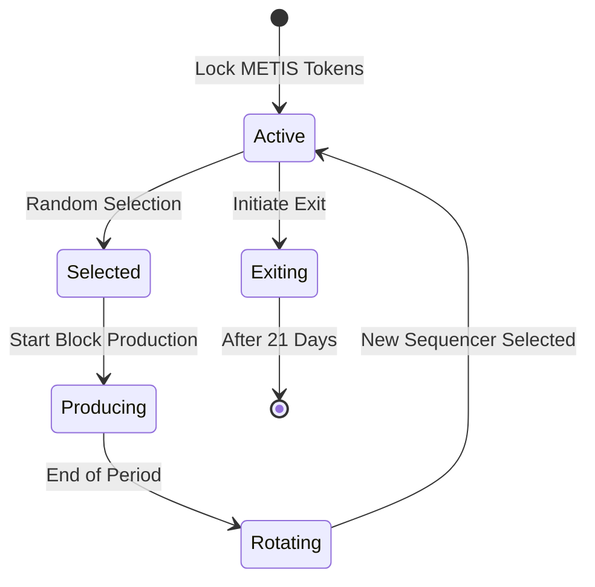

## Selection Process

The probability of choosing Sequencer A:

```math
P(A) = VotingPower(A) / TotalVotingPower
```

```math
VotingPower(A) = LockedAmount(A) / 10^{18}
```

This code implements a weighted random selection algorithm to choose blockchain producers for the next span in a provably fair way, the use of the block hash seed prevents manipulation. The key steps are:

1. It extracts a seed from the block hash to seed the random number generator;
2. Then converts each validator's voting power to a number of "slots" or weighted ranges proportional to their power;
3. After that, it generates a random number in the total weighted range;
4. To select a validator, It does a binary search to find which validator's range the random number falls into;
5. Lastly, it repeats steps 3-4 to select N producers based on their relative voting power;



## Example

The current lock is 20000 METIS, which means votingPower is 20000. To be more precise:

When a validator joins in `MsgValidatorJoin`, its voting power is calculated from its staked amount using the `GetPowerFromAmount()` function. This seems to convert the amount to voting power using some fixed ratio or formula.

In `GetPowerFromAmount()`, the amount is converted to an int64 voting power:

```go
// get voting power from amount
votingPower, err := helper.GetPowerFromAmount(msg.Amount.BigInt())
```

When a validator updates its stake in MsgStakeUpdate, the new voting power is recalculated from the new amount::

```go
// set validator amount
p, err := helper.GetPowerFromAmount(msg.NewAmount.BigInt())

if err != nil {
// handle error
}

validator.VotingPower = p.Int64()
```

So there is a direct correlation between stake amount and voting power, where stake amount is converted to voting power using a fixed ratio or formula.

## Rotation Process

Sequencer Lists are stored in a system contract named `MetisSequencerSet` on Metis L2 Chain. This contract is controlled by MPC address which needs several signers to set the sequencer info. The sequencer lists are rotated by PoS layer according to staking info on Ethereum L1 Chain.

There is another situation for sequencer rotation, when the active sequencer is down or out of service (currently no penalty is benign implemented in that regard).

The other sequencers will reselect a new sequencer according to consensus on the PoS layer.
