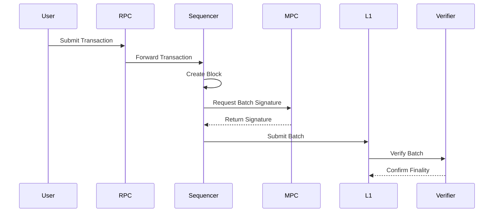

import { Step, Steps } from "fumadocs-ui/components/steps";

<Steps>

<Step>

## Transaction Initiation and Propagation

Users typically initiate transactions from a client, sign them, and submit them to the network. These transactions are sent directly to the RPC network.

The L2 transactions are then proxied to the Bridge & Adapter layer, which collaborates with the Proof of Stake (PoS) layer to ensure the transactions reach the current Sequencer's transaction pool.

</Step>

<Step>

## Block Formation and Sequencer Consensus

Upon receiving verified L2 transactions from the PoS layer via the Bridge & Adapter, the current Sequencer constructs a block and broadcasts it to the peer-to-peer (P2P) network.

Transactions originating from Ethereum L1 and enqueued via a cross-chain bridge are handled uniquely by the current Sequencer, which creates a block containing the single transaction.

The Bridge & Adapter monitors the transaction status from the current Sequencer. Other sequencers receiving blocks from the P2P network save it after verifying the Sequencer's signature on the transaction.

</Step>

<Step>

## Transaction Verification

The batcher program creates batch data and state root batch data, then solicits a signature from the Multi-Party Computation (MPC) module.

The PoS layer verifies the Sequencer's batch transaction signature and initiates the MPC signing process.

</Step>

<Step>

## Batching and Submission to Layer 1

After the MPC node signs the batches, they are dispatched to the Layer 1 Ethereum network.

</Step>

<Step>

## Layer 1 Verification and Finalization

A verifier, in sync with Ethereum Layer 1, validates the integrity of the batches, ensuring that the finalized block number aligns across both layers.

</Step>

</Steps>

## Finality Check

The Layer 2 block number is considered finalized after a sequencer rotation and consensus is reached by two-thirds of the sequencers.

The State Commitment Chain contract (SCC) on the Ethereum mainnet is critical for confirming the finality of batches. Batch submissions are made approximately every 30 minutes, when blocks reach finality in L2.
